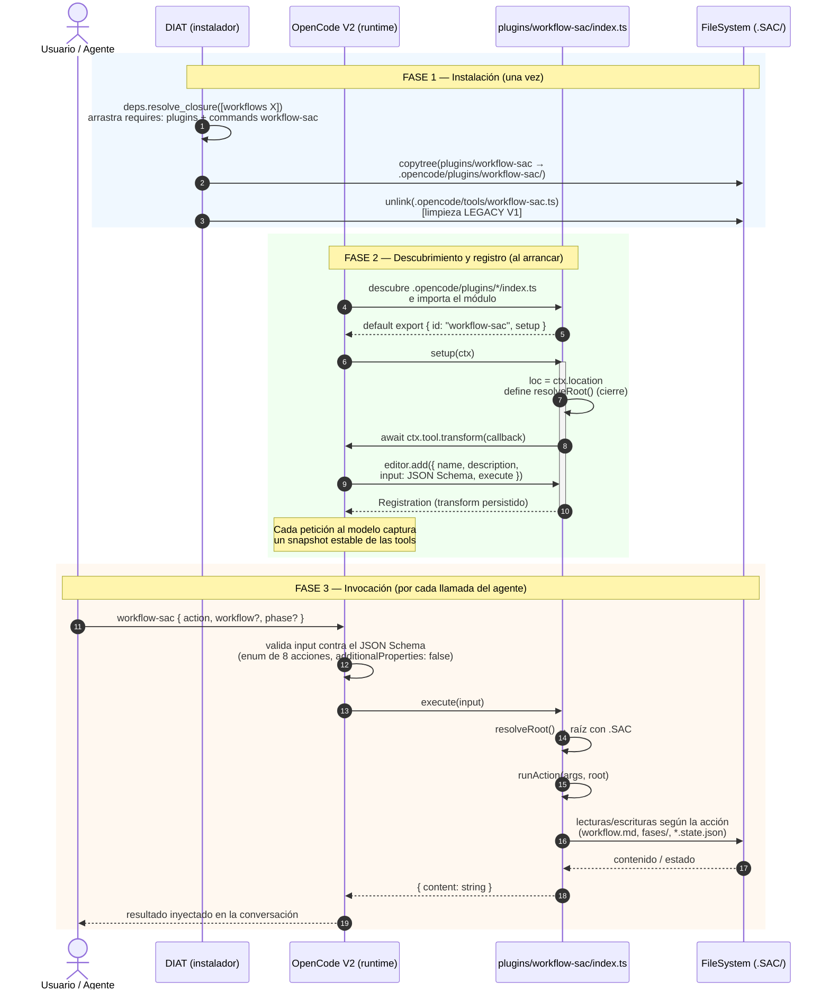
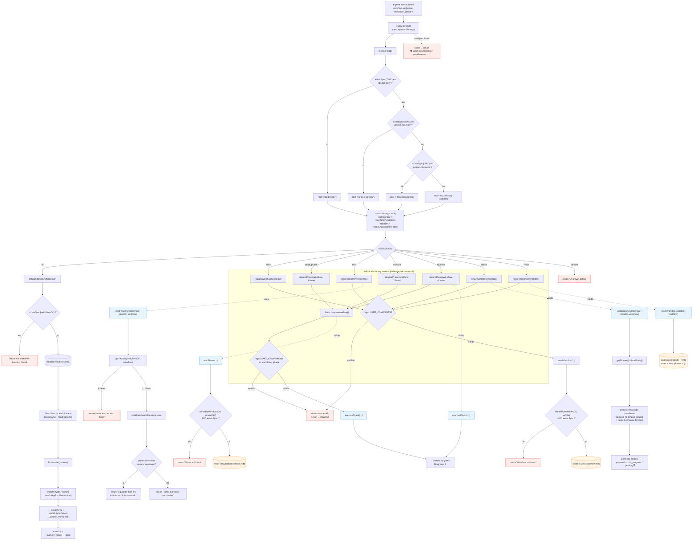
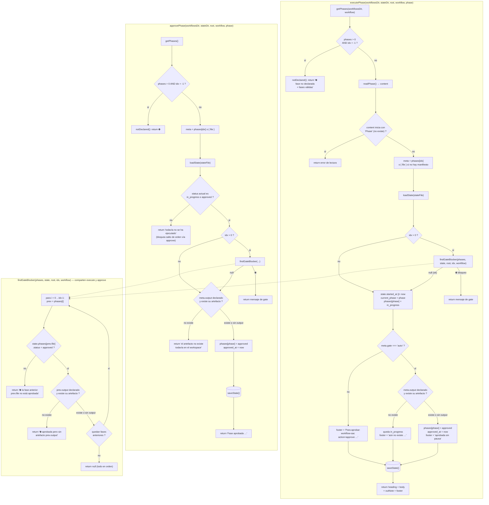
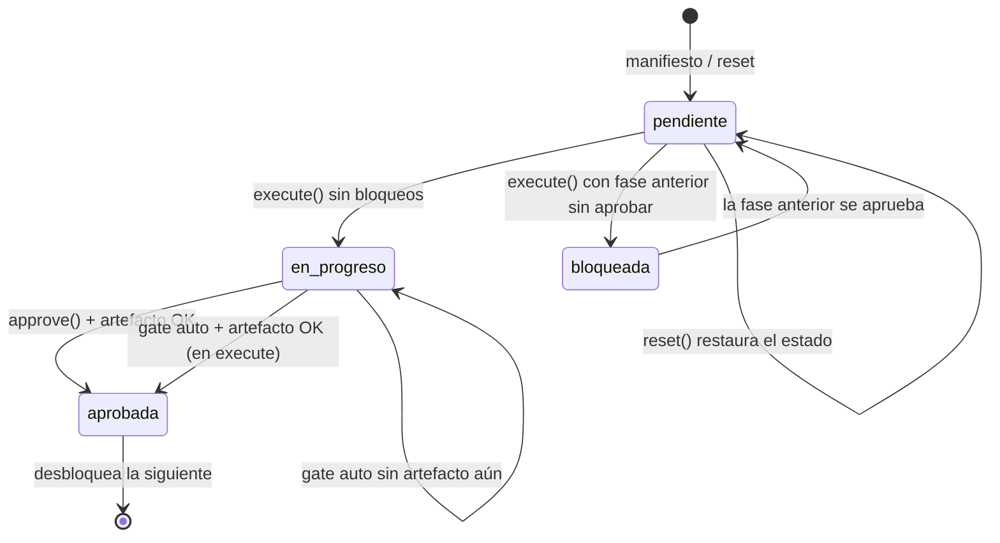
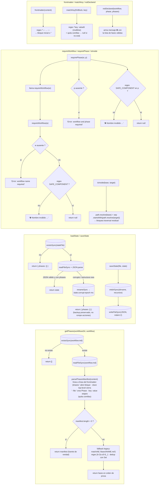

# Flujo del plugin `workflow-sac` — ciclo de vida, dispatch y gates

Diagrama detallado del plugin V2 [`plugins/workflow-sac/index.ts`](../../plugins/workflow-sac/index.ts):
cada función, cada llamada y cada operación de filesystem que realiza.

**Fuente de verdad:** `plugins/workflow-sac/index.ts` (commit `ef55587`).
**Vista previa:** GitHub renderiza los bloques `mermaid` automáticamente; en VS Code con la extensión *Mermaid Preview*.

---

## Leyenda

| Símbolo | Significado |
|---|---|
| `["rectángulo"]` | Función o paso del plugin |
| `{"rombo"}` | Condición / decisión |
| `[("cilindro")]` | Operación de filesystem (`fs.*`) |
| Flecha sólida `-->` | Llamada o flujo siguiente |
| Flecha punteada `-.->` | Manejo de error / flujo alternativo |
| Subgraph | Bloque temático o acción `runAction` |

---

## 1. Ciclo de vida: instalación → carga → registro → invocación



---

## 2. Dispatch completo: `execute` → `resolveRoot` → `runAction` → acción



---

## 3. Gates de fase: `executePhase` · `approvePhase` · `findGateBlocker`



### Máquina de estados de una fase



---

## 4. Helpers de datos (llamados por las acciones)



---

## 5. Tabla resumen: función → llamadas → filesystem

| Función | Llamadas internas | Operaciones `fs` |
|---|---|---|
| `setup(ctx)` | `ctx.tool.transform`, `editor.add`, `resolveRoot` (cierre) | — |
| `resolveRoot()` | `fs.existsSync(.SAC)` × candidatos | lectura (stat) |
| `execute(input)` | `resolveRoot`, `runAction` | — (vía `runAction`) |
| `runAction(args, root)` | `requireWorkflow`/`requirePhase` + despachador | — |
| `requireWorkflow` / `requirePhase` | regex `SAFE_COMPONENT` | — |
| `listWorkflows` | `frontmatter`, `matchKey` | `existsSync`, `readdirSync`, `readFileSync` |
| `readWorkflow` / `readPhase` | `isInside` | `existsSync`, `readFileSync` |
| `nextPhase` | `getPhases`, `loadState` | vía ambos |
| `executePhase` | `getPhases`, `readPhase`, `loadState`, `findGateBlocker`, `saveState` | `existsSync` (artefacto), lectura/escritura state |
| `approvePhase` | `getPhases`, `loadState`, `findGateBlocker`, `saveState` | `existsSync` (artefacto), escritura state |
| `getStatus` | `getPhases`, `loadState` | vía ambos |
| `resetWorkflow` | `saveState` | `mkdirSync`, `writeFileSync` |
| `findGateBlocker` | bucle sobre fases anteriores | `existsSync` (artefactos `output`) |
| `getPhases` | `parsePhasesManifest` o fallback legacy | `existsSync`, `readFileSync` |
| `parsePhasesManifest` | parser de frontmatter (sin YAML) | — |
| `loadState` | `JSON.parse` + backup en fallo | `existsSync`, `readFileSync`, `renameSync` |
| `saveState` | — | `mkdirSync`, `writeFileSync` |
| `frontmatter` / `matchKey` | regex | — |
| `notDeclared` / `isInside` | `path.resolve` | — |

---

## Rutas tocadas (siempre dentro de la raíz resuelta)

```text
<SAC root>/
├── .SAC/workflows/<workflow>/workflow.md      ← read, getPhases (manifiesto phases:)
├── .SAC/workflows/<workflow>/fases/<phase>    ← read_phase, execute
├── .SAC/workflow-state/<workflow>.state.json  ← loadState / saveState (next, execute, approve, status, reset)
└── <meta.output / meta.pre del manifiesto>    ← existsSync (gates de artefactos)
```

> **Invariantes:** toda acción pasa primero por `requireWorkflow`/`requirePhase` (regex `SAFE_COMPONENT`);
> toda ruta se verifica además con `isInside`; una fase no declarada en el manifiesto se rechaza explícitamente;
> ninguna fase se ejecuta ni aprueba si una anterior falta de aprobación o de su artefacto (`findGateBlocker`).
