# Flujo Team SAC — de la idea al primer Sprint

Guía rápida del orden recomendado para arrancar un proyecto desde cero con el toolkit SAC: 3 workflows de fundación, seguidos por el ciclo de skills que gestiona cada HU hasta cerrarse en un Sprint.

Diagrama técnico detallado (con el flujo interno de cada skill): [`flujo-team-sac.dot`](./flujo-team-sac.dot).

---

## Paso a paso

1. **`definir-vision-producto`** *(workflow)* — Idea cruda → Visión de Producto: problema, propuesta de valor, actores, alcance del MVP y NFRs preliminares.
2. **`definir-arquitectura-solucion`** *(workflow)* — Diseña la arquitectura completa (estilo, patrones/persistencia, cloud/seguridad, DevOps) en 4 ADRs aprobados uno por uno + Blueprint consolidado. Termina con la **Fase 7**: pregunta *"¿Consolidar propuesta arquitectónica?"* — si el usuario dice SI, un sub-agente crea ya el scaffold real del repo; si dice NO, deja constancia en `consolidacion.md` de que el scaffold debe entrar como las primeras HU Enabler del Sprint 0.
3. **`gestionar-backlog-roadmap`** *(workflow)* — Traduce ADRs + Visión (+ `consolidacion.md`) en épicas de negocio y de Enablers, matriz de dependencias y un roadmap por Sprint priorizado por WSJF.
4. **`iniciar-sprint`** *(skill)* — Materializa las HU/Stories del Sprint activo: crea `artifacts/HU/[ID]/HU.md` (estado `[ ]` Pendiente) y actualiza `backlog_desarrollo.md`. No refina nada, solo arma el andamiaje.
5. **`tomar-contexto`** *(skill)* — Genera o refresca `workspace.md` (stack, arquitectura, scorecard) leyendo el código real. Útil sobre todo una vez que ya existe código (tras el scaffold), no reemplaza a los ADRs.
6. **`refinar-hu`** / **`registrar-hallazgo`** *(skill)* — Por cada HU en `[ ]`: define criterios de aceptación SMART, estimación y desglose técnico vertical → pasa a `[R]` Refinada. `registrar-hallazgo` es el equivalente para bugs encontrados en desarrollo.
7. **`validar-hu`** *(skill)* — Valida la HU refinada contra SMART, arquitectura (ADRs) y dependencias reales. Resultado: `[A]` Aprobada, `AJUSTES` (vuelve a refinar) o `BLOQUEADA`.
8. **`priorizar-backlog`** *(skill)* — Una vez que **todas** las HU candidatas del Sprint están `[A]`/`[P]`, calcula el orden real de ejecución por dependencias técnicas + prioridad P0-P3 — nunca por el ID/título.
9. **`planificar-hu`** *(skill)* — Genera el plan técnico de implementación de cada HU, en el orden que dio `priorizar-backlog` → pasa a `[P]` Planificada.
10. **`ejecutar-plan`** + **`validar-ca`** *(skill)* — Implementa el plan con commits granulares (rama Git, reglas arquitectónicas); cada criterio de aceptación se valida contra el código real, no contra el plan.
11. **`sincronizar-backlog`** *(skill)* — Al cerrar el Sprint, reconcilia el estado de `backlog_desarrollo.md` con lo que realmente hay en disco (`Refinamiento.md`/`Plan.md` son la fuente de verdad) antes de arrancar el siguiente Sprint con `iniciar-sprint`.

---

## Diagrama del flujo ideal

```dot
digraph flujo_ideal_team_sac {
  rankdir=LR;
  node [fontname="Helvetica", fontsize=10, shape=box, style=filled];
  edge [fontname="Helvetica", fontsize=9];

  idea [label="Idea de negocio", shape=oval, fillcolor="#4A90D9", fontcolor=white];
  v1 [label="1. definir-vision-producto", fillcolor="#8E44AD", fontcolor=white];
  v2 [label="2. definir-arquitectura-solucion\n(+ Fase 7: ¿consolidar?)", fillcolor="#8E44AD", fontcolor=white];
  v3 [label="3. gestionar-backlog-roadmap", fillcolor="#8E44AD", fontcolor=white];
  v4 [label="4. iniciar-sprint", fillcolor="#50E3C2"];
  v5 [label="5. refinar-hu / registrar-hallazgo", fillcolor="#7BC67E"];
  v6 [label="6. validar-hu", fillcolor="#7BC67E"];
  v7 [label="7. priorizar-backlog", fillcolor="#9B59B6", fontcolor=white];
  v8 [label="8. planificar-hu", fillcolor="#7BC67E"];
  v9 [label="9. ejecutar-plan + validar-ca", fillcolor="#7BC67E"];
  v10 [label="10. sincronizar-backlog", fillcolor="#7ED321"];
  fin [label="Sprint cerrado", shape=oval, fillcolor="#4A90D9", fontcolor=white];

  idea -> v1 -> v2 -> v3 -> v4 -> v5 -> v6;
  v6 -> v7 [label="todas las HU\naprobadas"];
  v7 -> v8 [label="en el orden\nsugerido"];
  v8 -> v9 -> v10 -> fin;
  fin -> v4 [label="siguiente sprint", style=dashed];
}
```

> Este diagrama es la versión "de un vistazo" (10 pasos, sin ramas de error/bloqueo). Para el detalle completo — incluyendo bloqueos, ciclos, particionado de HU y el flujo interno de cada skill — usa [`flujo-team-sac.dot`](./flujo-team-sac.dot).
