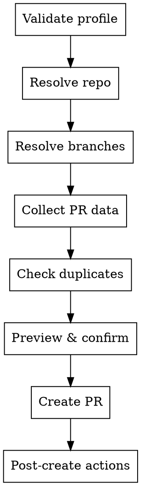

# ADO PR Creator

Guided creation of Pull Requests in Azure DevOps with duplicate detection, branch validation, and mandatory preview before publishing.

## When to Use

- User wants to create/open a new PR
- User wants to assign reviewers or link work items to a PR
- User pastes an ADO repo URL asking to create a PR

**When NOT to use:**

- Reviewing or approving existing PRs
- Updating/abandoning PRs that already exist
- Merging completed PRs

## Context Injection

Reads `project_repos`, `project_workitems`, `user_email` from `memory_skill.json` → `[ado].config.perfiles[perfil_activo]` (standalone).

## Core Flow

### Phase A — Validate & resolve

Ensure `project_repos` is resolved. If missing, stop and inform user.

### Phase B — Resolve repo & branches

1. **Repo:** User-specified → `ado_repo_repository` (get). Otherwise try `git remote get-url origin`. Fallback: list repos and ask user.
2. **Source branch:** User-specified → `git branch --show-current` → ask user.
3. **Target branch:** User-specified → list environment branches (develop, qa, staging, main, etc.) → ask user.
4. Validate both exist with `ado_repo_branch` (get). Reject if `source = target`.
5. **Rule:** Strip `refs/heads/` for display; re-add only for API calls.

### Phase C — Collect PR data

- **Title:** Conventional Commits `type(scope): summary`. Validate or propose correction.
- **Description:** Draft with Summary, Main Changes, Expected Commits, Validation, Breaking Changes, Work Items.
- **Reviewers** and **Work Items:** Optional.

### Phase D — Duplicate check & preview

1. Search active PRs via `ado_repo_pull_request` (list) for same source→target. If duplicate, show existing instead of creating.
2. Present preview table with repo, branches, title, reviewers, work items.
3. Require explicit `[S]` confirmation. Never publish without it.

### Phase E — Create PR & post-actions

1. `ado_repo_pull_request` (create) with `refs/heads/{source}` → `refs/heads/{target}`.
2. Add reviewers via `ado_repo_pull_request` (update_reviewers) if any.
3. Link work items via `ado_wit_work_item_link_write` (link_to_pull_request) if any.
4. Report: PR URL, ID, branch flow, reviewers, work items.
5. Offer: review the new PR, view active PRs, or done.

## Quick Reference

| Error | Response |
|-------|----------|
| No diff between branches | "No changes to propose between [source] and [target]." |
| Source branch missing remotely | "Branch not published in ADO. Push it first." |
| Reviewer resolution fails | Continue without them, report which failed |
| Work item link fails | Don't cancel PR, report which weren't linked |
| 401/403 | Inform user, don't auto-retry more than once |

## Common Mistakes

- **Not stripping/re-adding `refs/heads/`** — strip for display, re-add for API calls.
- **Assuming target branch:** Always ask user after showing environment branches.
- **Skipping duplicate check:** Always verify no active PR exists for same source→target.
- **Blocking on non-critical failures:** Reviewers or work item link failures shouldn't cancel creation.
