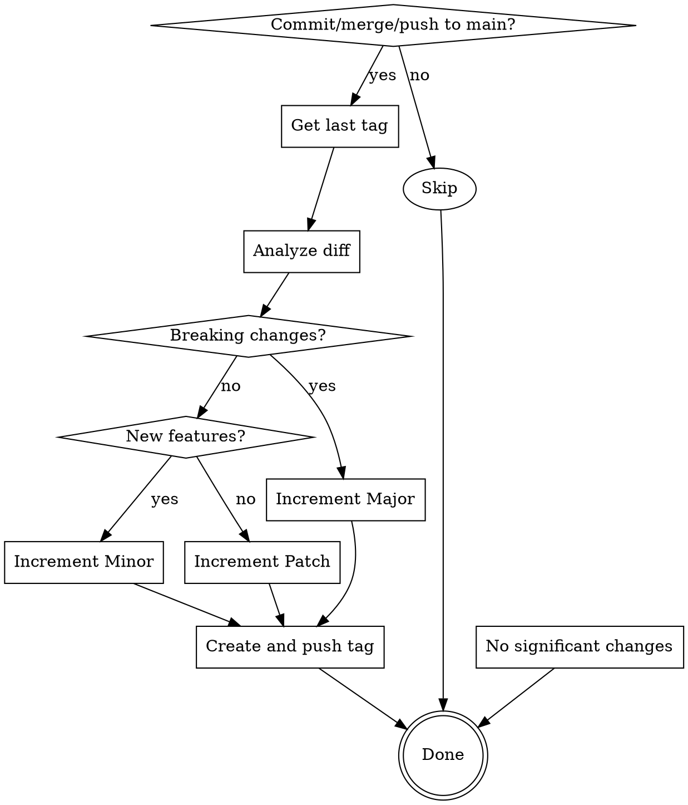

# Auto-Versioning

## Overview

Determines the next semantic version by analyzing code diffs between the last tag and pending changes. Follows SemVer rules: breaking changes → Major, new features → Minor, fixes/docs → Patch.

## When to Use

- Committing to main branch
- Merging a PR to main
- Pushing changes to main

**Flowchart:**



## When NOT to Use

- Committing to feature branches (use manual versioning or skip)
- Hotfix branches (determine version after merge to main)
- Initial project setup (start at v0.1.0 manually)

## Quick Reference

| Change Type | Example | Bump |
|---|---|---|
| API removal, signature change | Remove `getUser()` endpoint | Major |
| New feature, new endpoint | Add `exportCSV()` function | Minor |
| Bug fix, docs, refactor | Fix typo, update README | Patch |

## Diff Analysis Triggers

**Major:** Removed public APIs, changed signatures, deleted endpoints, modified schema/config format

**Minor:** Added functions/classes, new endpoints, new features, new config options

**Patch:** Bug fixes, docs, refactoring, performance, tests

## Commands

```bash
# Get last tag
git describe --tags --abbrev=0

# Get diff
git diff {last_tag}...HEAD

# Create tag
git tag -a v{version} -m "Release {version}" && git push origin v{version}
```

## Common Mistakes

| Mistake | Fix |
|---|---|
| Analyzing commit messages only | Always inspect actual code diffs |
| Missing removed APIs | Check for deletions and signature changes |
| Forgetting to push tags | Push immediately after creation |
| Tagging feature branches | Only tag on main branch |
