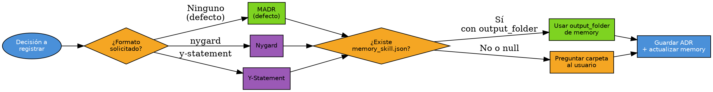

# Registrar Decisiones de Arquitectura (ADRs)

## Overview

Un ADR documenta **una** decisión de arquitectura: contexto, drivers, opciones consideradas, decisión y consecuencias. Usa siempre una de las plantillas de `assets/` — no improvises la estructura.

## Cuando Usar

- Usuario pide crear/registrar/escribir un ADR o "documentar una decisión técnica/arquitectura"
- Se cierra un estudio (spike) o blueprints con una decisión tomada que debe quedar registrada
- Cualquier decisión de diseño con más de una opción viable

Cuándo NO: decisiones triviales reversibles (naming, formato menor) o requisitos que no cambian la arquitectura.

## Decision Flow

## Implementación

### 1. Reunir la decisión (preguntar solo lo que falte)

Elicita estos 6 elementos antes de escribir:
| Elemento | Pregunta |
|---|---|
| Título | ¿Qué decisión se registra? |
| Contexto/Problema | ¿Qué situación motiva la decisión? |
| Drivers | ¿Qué factores pesan (costo, rendimiento, equipo, plazos)? |
| Opciones consideradas | ¿Qué alternativas se evaluaron? |
| Decisión | ¿Cuál se eligió y por qué? |
| Consecuencias | ¿Qué gana y qué paga el equipo? |

Si el usuario no aporta drivers/opciones/consecuencias, pregúntalos — **no los dejes vacíos**.

### 2. Elegir plantilla (`assets/`)

- **Por defecto:** `{file:./assets/adr_madr.md}` (MADR — la más completa)
- Usuario pide "nygard" → `{file:./assets/adr_nygard.md}`
- Usuario pide "y-statement" / "y statement" → `{file:./assets/adr_y_statement.md}`

### 3. Resolver el destino (NO inventes la carpeta)

Orden estricto:
1. Si existe `memory_skill.json` en la raíz de `skills/` (`$SKILL_DIR/../memory_skill.json`) y tiene campo `output_folder` (global) → usar esa carpeta.
2. Si `output_folder` es `null` o no existe → **preguntar al usuario la carpeta** donde vive la colección de ADRs.
3. **Si la carpeta no existe, créala** antes de guardar el ADR.
4. Si existe `memory_skill.json`, **persistir** la carpeta en `output_folder` (global) y `last_number` en `[crear-adr].memory` tras guardar.
5. Si no existe `memory_skill.json`, **créalalo** con el campo `output_folder` y la sección `[crear-adr]`.

### 4. Numeración

- Nombre del archivo: `NNNN-titulo-slug.md` (4 dígitos + slug del título, en minúsculas con guiones).
- Escanea el destino por `*.md` → toma el máximo prefijo `NNNN` y usa `máximo + 1`. **Nunca reinicies en 001** porque parezca un directorio nuevo.
- Rellena el campo de número de la plantilla con el mismo valor.

### 5. Campos obligatorios

- **Estado:** `Propuesto` por defecto (el usuario puede decir Aceptado/Reemplazado/Obsoleto).
- **Decisores:** pregunta quiénes toman la decisión — **no dejes este campo sin autores reales**.
- **Fecha:** hoy (ISO).
- **Consecuencias positivas y negativas:** ambas secciones.
- **Validación** (solo MADR): cómo se sabrá que la decisión fue correcta.
- **Diagrama:** solo si aplica; si no, omítelo.

### 6. Guardar y reportar

Guarda el archivo, actualiza `memory_skill.json` si existe, y reporta:
`✅ ADR NNNN: [título] | Formato: [formato] | Ruta: [ruta] | Estado: [estado]`

## Errores Comunes

| Excusa | Realidad |
|--------|----------|
| "Guardo donde parezca lógico" | Ubicación NO determinística → resolver desde `memory_skill.json` o preguntar |
| "Uso la estructura estándar que recuerdo" | Debes usar la plantilla exacta de `assets/` correspondiente |
| "Omito Decisores/Validación porque no me los dieron" | Son campos obligatorios → preguntar |
| "Reinicio en 001" | Numeración = máximo existente + 1 |
| "Sigo con otra cosa, el registro ya quedó" | Verificar el resumen (ruta, número, estado) antes de terminar |

## Quick Reference

| Acción | Resultado |
|--------|-----------|
| `crea un ADR para <decisión>` | MADR default → `<output_folder>/NNNN-titulo-slug.md` |
| `...con formato nygard` | `assets/adr_nygard.md` |
| `...y-statement` | `assets/adr_y_statement.md` |
| Sin `memory_skill.json` ni `[crear-adr]` | Pregunta carpeta y la persiste |