# Crear Estrategia — ms-banca-conversacion

Genera estrategias de interacción para la FSM del chatbot de WhatsApp.

## Overview

Cada estrategia es un nodo de la FSM identificado por el par `(EtapaInteraccion, DisparadorDeEstrategia)`. Extienden `EstrategiaBase` (Template Method) que orquesta auditoría, reintentos, desborde a agente humano y envío de mensajes WhatsApp.

## When to Use

- El usuario pide crear un nuevo flujo conversacional (ej: "tarjeta de crédito", "seguros vida")
- Se necesita agregar una etapa al FSM existente
- Se requiere un nuevo menú con opciones fijas
- Hay un nuevo evento de otro microservicio que debe reaccionar

### Cuándo NO usar

- Para modificar la lógica de una estrategia existente (editar directamente el archivo)
- Para cambios en la configuración de plantillas WhatsApp (no es cambio de estrategia)
- Para bugs en la FSM existente (usar systematic-debugging)

## Rutas del proyecto

```
DOMINIO  = ms-banca-conversacion/microservicio/dominio/src/main/java/co/com/bmm
INFRA    = ms-banca-conversacion/microservicio/infraestructura/src/main/java/co/com/bmm
TESTS    = ms-banca-conversacion/microservicio/dominio/src/test/java/co/com/bmm
```

| Archivo | Ruta |
|---------|------|
| EstrategiaBase | `{DOMINIO}/maquina_estados/estrategias/EstrategiaBase.java` |
| EstrategiaDeInteraccionPorEtapa | `{DOMINIO}/puerto/EstrategiaDeInteraccionPorEtapa.java` |
| DependenciasEstrategiaBase | `{DOMINIO}/maquina_estados/estrategias/DependenciasEstrategiaBase.java` |
| EtapaInteraccion | `{DOMINIO}/modelo/EtapaInteraccion.java` |
| DisparadorDeEstrategia | `{DOMINIO}/modelo/DisparadorDeEstrategia.java` |
| ContextoEstrategia | `{DOMINIO}/modelo/ContextoEstrategia.java` |
| ResultadoEstrategia | `{DOMINIO}/dto/ResultadoEstrategia.java` |
| PlantillaMensajeId | `{DOMINIO}/modelo/PlantillaMensajeId.java` |
| MotorFsmConfiguration | `{INFRA}/configuracion/MotorFsmConfiguration.java` |
| Estrategias existentes | `{DOMINIO}/maquina_estados/estrategias/` (subcarpetas temáticas) |

## Flowchart

```dot
digraph crear_estrategia {
  rankdir=LR;
  node [fontname="Helvetica", fontsize=10];
  edge [fontname="Helvetica", fontsize=9];

  start [label="Iniciar", shape=oval, style=filled, fillcolor="#4A90D9", fontcolor=white];
  f1 [label="Fase 1\nRecopilar info", shape=box, style=filled, fillcolor="#7BC67E"];
  f2 [label="Fase 2\nAgregar etapas\nEtapaInteraccion", shape=box, style=filled, fillcolor="#7BC67E"];

  new_trigger [label="Disparador\nnuevo?", shape=diamond, style=filled, fillcolor="#F5A623"];
  f3 [label="Fase 3\nAgregar\ndisparadores", shape=box, style=filled, fillcolor="#50E3C2"];
  skip3 [label="Omitir\nfase 3", shape=box, style=filled, fillcolor="#BD10E0", fontcolor=white];

  has_menu [label="Menú con\nopciones fijas?", shape=diamond, style=filled, fillcolor="#F5A623"];
  f4 [label="Fase 4\nCrear enum\nOpcionMenu", shape=box, style=filled, fillcolor="#50E3C2"];
  skip4 [label="Omitir\nfase 4", shape=box, style=filled, fillcolor="#BD10E0", fontcolor=white];

  f5 [label="Fase 5\nCrear clase(s)\nestrategia", shape=box, style=filled, fillcolor="#7BC67E"];
  f6 [label="Fase 6\nRegistrar beans\nMotorFsmConfig", shape=box, style=filled, fillcolor="#7BC67E"];
  f7 [label="Fase 7\nCrear tests\nunitarios", shape=box, style=filled, fillcolor="#7BC67E"];

  new_templates [label="Plantillas\nnuevas?", shape=diamond, style=filled, fillcolor="#F5A623"];
  f8 [label="Fase 8\nAgregar\nPlantillaMensajeId", shape=box, style=filled, fillcolor="#50E3C2"];
  skip8 [label="Omitir\nfase 8", shape=box, style=filled, fillcolor="#BD10E0", fontcolor=white];

  f9 [label="Fase 9\nValidaciones\nfinales", shape=box, style=filled, fillcolor="#7BC67E"];
  compile [label="Compilación\nexitosa?", shape=diamond, style=filled, fillcolor="#F5A623"];
  done [label="Listo", shape=oval, style=filled, fillcolor="#7ED321", fontcolor=white];

  start -> f1 -> f2 -> new_trigger;
  new_trigger -> f3 [label="Sí"];
  new_trigger -> skip3 [label="No"];
  f3 -> has_menu;
  skip3 -> has_menu;

  has_menu -> f4 [label="Sí"];
  has_menu -> skip4 [label="No"];
  f4 -> f5;
  skip4 -> f5;

  f5 -> f6 -> f7 -> new_templates;
  new_templates -> f8 [label="Sí"];
  new_templates -> skip8 [label="No"];
  f8 -> f9;
  skip8 -> f9;

  f9 -> compile;
  compile -> done [label="Sí"];
  compile -> f5 [label="No,\ncorregir"];
}
```



## Implementation

### Fase 1 — Recopilar información

Preguntar al usuario (formato opciones de respuesta rápida):

1. **Nombre del flujo/funcionalidad** — Ej: "tarjeta de crédito", "seguros vida"
2. **Subflujo padre** — Carpeta (`productos/`, `retiros/`, `creditos/`, `referidos/`, o nueva)
3. **Etapas del flujo** — Lista con: nombre (→ SCREAMING_SNAKE_CASE), descripción, transición
4. **Disparador por etapa** — Por defecto `EVENTO_MENSAJE_WHATSAPP`. Preguntar solo si hay etapas que reaccionen a otros microservicios
5. **¿Permite desborde a agente humano?**
6. **¿Captura flujo de navegación?**
7. **Opciones de menú** — Si hay menús con opciones fijas (se crea enum `OpcionMenu{Nombre}`)
8. **Dependencias adicionales** — Más allá de `DependenciasEstrategiaBase` (ej: `ServicioGestionFlujos`, `@Value`, puertos)
9. **Plantillas de mensaje** — Nombres en `PlantillaMensajeId` (verificar existencia o agregar)

### Fase 2 — Agregar etapas al enum `EtapaInteraccion`

Abrir `{DOMINIO}/modelo/EtapaInteraccion.java` y agregar antes de `FINAL_INTERACCION`, agrupadas con comentario de sección.

**Convenciones:**
- SCREAMING_SNAKE_CASE
- Constructor `(boolean capturaFlujoNavegacion)` si NO permite desborde
- Constructor `(boolean capturaFlujoNavegacion, boolean permiteDesborde)` si SÍ permite desborde

```java
// ═══ Etapas Flujo {NOMBRE_FLUJO} ═══
/** Descripción de la etapa */
{NOMBRE_ETAPA_1}(false, true),   // capturaFlujo=false, permiteDesborde=true
{NOMBRE_ETAPA_2}(true),          // capturaFlujo=true, SIN desborde
```

### Fase 3 — Agregar disparadores (si nuevos)

Solo si el flujo necesita un disparador que NO exista en `DisparadorDeEstrategia`:

| Disparador | Uso |
|------------|-----|
| `EVENTO_MENSAJE_WHATSAPP` | Usuario envía mensaje de texto/botón |
| `EVENTO_RESPUESTA_SERVICIOS_MS` | Respuesta de otro microservicio vía RabbitMQ |
| `EVENTO_ERROR_SERVICIO_EXTERNO` | Error de servicio externo |
| `VALIDACION_EXITOSA` | Validación interna exitosa |
| `EVENTO_RESPUESTA_OTP_INFOBIT` | Respuesta del servicio OTP |

### Fase 4 — Crear enum de opciones de menú (si aplica)

Si el flujo tiene menú con opciones fijas, crear en `{DOMINIO}/modelo/`.

Ver plantilla completa: `references/plantilla-enum.java`

### Fase 5 — Crear la(s) clase(s) de estrategia

Crear en `{DOMINIO}/maquina_estados/estrategias/{subflujo}/{nombre_flujo}/`.

Ver plantilla completa: `references/plantilla-estrategia.java`

**Hooks opcionales sobreescribibles:**

| Método | Cuándo usarlo |
|--------|---------------|
| `respuestaValidadaConContexto(ContextoEstrategia)` | Validación necesita más que solo el texto |
| `capturarFlujoNavegacion(ContextoEstrategia, ResultadoEstrategia)` | `getEtapa().capturaFlujoNavegacion() == true` |
| `getPlantillaPreguntaEtapa()` | Plantilla al volver de desborde a agente |
| `getFlowInfoDesborde()` | WhatsApp Flows + restaurar al volver de agente |
| `getCampoActual()` | Identificar campo capturado (conteo de errores) |

### Fase 6 — Registrar beans en `MotorFsmConfiguration`

Abrir `{INFRA}/configuracion/MotorFsmConfiguration.java` y agregar `@Bean` por cada estrategia:

```java
// ═══════════════════════════════════════════════════════════════
// {NOMBRE_FLUJO}
// ═══════════════════════════════════════════════════════════════

@Bean
public Estrategia{NombreEstrategia} estrategia{NombreEstrategia}(
        DependenciasEstrategiaBase dependencias) {
    return new Estrategia{NombreEstrategia}(dependencias);
}
```

Con dependencias adicionales o `@Value`:

```java
@Bean
public Estrategia{NombreEstrategia} estrategia{NombreEstrategia}(
        DependenciasEstrategiaBase dependencias,
        ServicioGestionFlujos servicioGestionFlujos) {
    return new Estrategia{NombreEstrategia}(dependencias, servicioGestionFlujos);
}

@Bean
public Estrategia{NombreEstrategia} estrategia{NombreEstrategia}(
        DependenciasEstrategiaBase dependencias,
        @Value("${whatsapp.flow.{nombre}.id}") String flowId) {
    return new Estrategia{NombreEstrategia}(dependencias, flowId);
}
```

> **IMPORTANTE:** No usar `@Component` ni `@Service` en clases de estrategia. Registro explícito vía `@Bean` en `MotorFsmConfiguration` para mantener Clean Architecture.

### Fase 7 — Crear tests unitarios

Crear en `{TESTS}/maquina_estados/estrategias/{subflujo}/{nombre_flujo}/`.

Ver plantilla completa: `references/plantilla-test.java`

### Fase 8 — Agregar PlantillaMensajeId (si nuevas)

Si las plantillas no existen en `PlantillaMensajeId`, agregarlas al enum con nombre SCREAMING_SNAKE_CASE.

### Fase 9 — Validaciones finales

- [ ] No hay etapas duplicadas en `EtapaInteraccion`
- [ ] No hay pares `(Etapa, Disparador)` duplicados
- [ ] Transiciones forman flujo coherente (sin huérfanas ni ciclos infinitos)
- [ ] Cada estrategia tiene `@Bean` en `MotorFsmConfiguration`
- [ ] Cada estrategia tiene test unitario
- [ ] Imports correctos con packages del dominio
- [ ] Clases sin anotaciones Spring (`@Component`, `@Service`)
- [ ] Compilación exitosa: `cd ms-banca-conversacion && ./gradlew compileJava compileTestJava`

## Quick Reference

### Patrones de ResultadoEstrategia

| Patrón | Uso |
|--------|-----|
| `new ResultadoEstrategia(etapa, null, plantillas, args)` | Transición simple con mensajes |
| `ResultadoEstrategia.sinEvento(etapa, plantillas, args)` | Sin evento RabbitMQ |
| `ResultadoEstrategia.conEstadoFinal(etapa, null, plantillas, args, estadoFinal)` | Finalizar interacción |
| `ResultadoEstrategia.conFlow(etapa, null, plantillas, args, flowInfo)` | Enviar WhatsApp Flow |
| `ResultadoEstrategia.conMensajesPreviosYFlow(...)` | Mensajes previos + WhatsApp Flow |

### Ejemplo: switch de opciones de menú

```java
@Override
protected ResultadoEstrategia logicaEspecificaDeEtapa(ContextoEstrategia ctx) {
    String id = ctx.mensaje();
    return switch (OpcionMenuMiFlujo.fromId(id).get()) {
        case OPCION_A -> new ResultadoEstrategia(
                EtapaInteraccion.MI_FLUJO_DETALLE_A, null,
                List.of(PlantillaMensajeId.MI_FLUJO_INFO_A),
                dependencias.LISTA_ARGS_VACIA);
        case OPCION_B -> new ResultadoEstrategia(
                EtapaInteraccion.MI_FLUJO_DETALLE_B, null,
                List.of(PlantillaMensajeId.MI_FLUJO_INFO_B),
                dependencias.LISTA_ARGS_VACIA);
        case VOLVER -> new ResultadoEstrategia(
                EtapaInteraccion.VALIDAR_OPCION_SELECCIONADA_MENU_INICIAL, null,
                List.of(PlantillaMensajeId.MENU_INICIAL),
                dependencias.LISTA_ARGS_VACIA);
    };
}

@Override
protected boolean respuestaValidada(String respuesta) {
    return OpcionMenuMiFlujo.fromId(respuesta).isPresent();
}
```

### Ejemplo: respuesta de servicio externo

```java
@Override
public DisparadorDeEstrategia getDisparador() {
    return DisparadorDeEstrategia.EVENTO_RESPUESTA_SERVICIOS_MS;
}

@Override
protected boolean respuestaValidada(String respuesta) {
    return true;
}

@Override
protected ResultadoEstrategia logicaEspecificaDeEtapa(ContextoEstrategia ctx) {
    return new ResultadoEstrategia(
            EtapaInteraccion.{SIGUIENTE_ETAPA}, null,
            List.of(PlantillaMensajeId.{PLANTILLA_RESULTADO}),
            dependencias.LISTA_ARGS_VACIA);
}
```

### Ejemplo: WhatsApp Flow

```java
public class EstrategiaMiFlujoInicioFormulario extends EstrategiaBase {
    private final String flowId;

    public EstrategiaMiFlujoInicioFormulario(DependenciasEstrategiaBase dependencias, String flowId) {
        super(dependencias);
        this.flowId = flowId;
    }

    @Override
    protected ResultadoEstrategia logicaEspecificaDeEtapa(ContextoEstrategia ctx) {
        return ResultadoEstrategia.conMensajesPreviosYFlow(
                EtapaInteraccion.MI_FLUJO_ESPERANDO_FLOW, null,
                List.of(PlantillaMensajeId.MI_FLUJO_INSTRUCCIONES),
                dependencias.LISTA_ARGS_VACIA,
                new FlowInfo(flowId, PlantillaMensajeId.MI_FLUJO_FLOW_BODY, PlantillaMensajeId.MI_FLUJO_FLOW_CTA)
        );
    }

    @Override
    protected boolean respuestaValidada(String respuesta) { return true; }

    @Override
    protected ResultadoEstrategia manejarRespuestaInvalida(ContextoEstrategia contexto) { return null; }
}
```

## Common Mistakes

| Error | Solución |
|-------|----------|
| Duplicar `(Etapa, Disparador)` — `MotorDeInteraccion` lanza excepción | Verificar unicidad antes de crear la estrategia |
| Usar `@Component` / `@Service` en clases de estrategia | Registrar vía `@Bean` en `MotorFsmConfiguration` (Clean Architecture) |
| Agregar etapa sin constructor correcto | Si permite desborde → `(boolean, boolean)`. Si no → `(boolean)` |
| Olvidar agregar `@Bean` en configuración | La estrategia no se registra y la FSM falla |
| No crear test unitario | Cada estrategia requiere su test |
| Crear enum `EtapaInteraccion` duplicado | Buscar etapas existentes antes de agregar |
