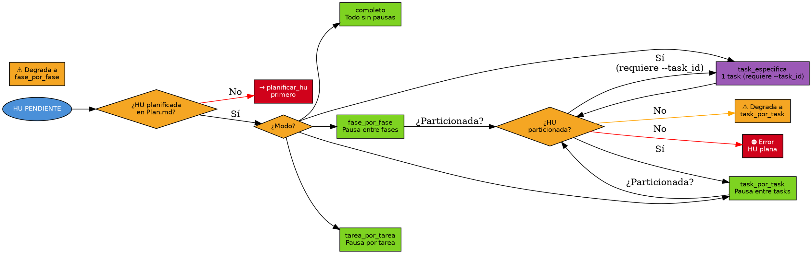

# Ejecutar Plan

## Overview
Implementa el plan de una HU actualizando Plan.md en tiempo real, aplicando reglas arquitectónicas, creando rama Git y validando criterios de aceptación con la skill `validar-ca` (ejecutada como sub-agente).

## When to Use
- Una HU tiene Estado = `PENDIENTE` en Plan.md y el usuario pide implementarla.
- Se requiere ejecución guiada (por fase, tarea o task) con commits granulares.

**Cuándo NO usar:** si la HU no está planificada (ejecutar `>planificar_hu` primero); si solo se quiere revisar código sin implementar.

## Decision Flow

## Implementation
1. **Cargar configuración:** leer `.SAC/config/CONFIG_SYSTEM.yaml` y `CONFIG_USER.yaml`. Si existe `{archivos.reglas_arquitectonicas}`, cargar reglas (nomenclatura, estructura, patrones, SOLID, nulls, límites) para aplicar en implementación.
2. **Cargar plan:** verificar `{hu_folder}/[ID-HU]/Plan.md` con Estado = `PENDIENTE`; cambiar HU a [E] En Ejecución y Plan.md a `EN_PROGRESO`; crear Tracking.md si falta.
3. **Resolver modo:** validar combinaciones (`completo` + `--auto_commit` prohibido; `task_id` requiere `task_especifica`). Ver degradación en Quick Reference.
4. **Preparar entorno:** cargar reglas, preguntar rama base (main/develop/otra), crear `feature/[ID-HU]-[desc]`, y `git stash` si hay cambios sin commit. Detectar framework de tests.
5. **Ejecutar:** por cada fase/task, EDITAR Plan.md (`[PENDIENTE]`→`[EN_PROGRESO]`→`[EJECUTADA]` y `- [ ]`→`- [X]`) en cada transición. Aplicar reglas arquitectónicas. Commit por task: `feat([ID-HU]-TASK-N): …`. Máximo 2 reintentos por tarea; fallo → DETENER.
6. **Validar CAs:** delegar en un sub-agente que ejecute la skill `validar-ca` (`>validar_ca`). Si FAIL → DETENER.
7. **Commit final:** solo al completar TODA la HU: `feat([ID-HU]): implementación completa de [título]`.
8. **Finalizar:** Plan.md → `COMPLETADO`, Tracking.md → `FINALIZADO`. En `task_especifica` con tasks pendientes, NO completar la HU.

## Quick Reference
| Modo | HU Plana | HU Particionada |
|------|----------|-----------------|
| `completo` | Todo sin pausas | Tasks secuenciales sin pausas |
| `fase_por_fase` | Pausa entre fases | ⚠️ Degrada a `task_por_task` |
| `tarea_por_tarea` | Pausa por tarea | Pausa por tarea técnica |
| `task_por_task` | ⚠️ Degrada a `fase_por_fase` | Pausa entre tasks |
| `task_especifica` | ⛔ Error | Ejecuta solo una task (requiere `--task_id`) |

| Opción | Descripción |
|--------|-------------|
| `id_hu` | Identificador de la HU (requerido) |
| `--proyecto` | Proyecto concreto (auto-detectado) |
| `--modo_ejecucion` | Ver tabla (def. `fase_por_fase`) |
| `--task_id` | ID de task (solo `task_especifica`) |
| `--auto_commit` | Commit automático sin confirmación |

## Common Mistakes
| Error | Causa | Solución |
|-------|-------|----------|
| Plan no encontrado | Falta Plan.md | Ejecutar `>planificar_hu` primero |
| Plan no está PENDIENTE | Ya en curso/completado | Verificar flujo de estados |
| Error de compilación | Código con errores | Revisar código generado |
| Tests fallando | Lógica/tests incorrectos | Revisar lógica o actualizar tests |
