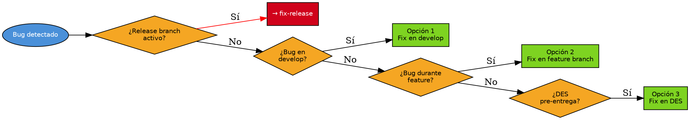

# Fix Develop

## Overview

Gestiona la resolución de bugs durante el desarrollo, antes de la entrega formal al banco.

## When to Use

**Usar cuando:** Bug en develop tras merge, en feature branch sin merge, o en DES pre-entrega formal.

**No usar cuando:** Bug post-entrega (PRU/PREPRO/PRO) → `fix-release`. Entrega formal → `entrega-ambiente-banco`. Feature nueva → desarrollo normal.

## Decision Flow

## Implementation

### Datos de entrada

Preguntar: "¿Cuál es el ID del bug?" (WA2-xxx o descripción), "¿Qué commit lo introdujo?" Mostrar: `git log develop --oneline -10`.

### Opción 1 — Bug en DEVELOP

**Trivial (1-2 commits):** Fix directo sobre develop. Validar tests (`references/test-commands.md`). Push.

**Complejo:** Crear `bugfix/WA2-xxx-<desc>`. Validar tests. Push + PR `bugfix/WA2-xxx → develop`.

### Opción 2 — Bug durante feature

Fix sobre la misma feature branch. Validar tests. Push. No crear branch adicional.

### Opción 3 — Bug en DES pre-entrega

Verificar que NO existe release branch activo (`git branch -a | grep release/`). Si existe → `fix-release`. Fix sobre develop. Validar tests. Push.

## Quick Reference

| Concepto | Convención |
|----------|------------|
| Rama bug | `bugfix/WA2-xxx-<desc>` |
| Feature bug | Dentro de la feature branch |
| Commit | `fix: [WA2-xxx] <descripción>` |
| Tests | `references/test-commands.md` |
| Manual | `{file:./references/MANUAL_PASO_AMBIENTES_SECCIONES.md}` §3.1, §5 |

**Reglas:** Bug en develop = fix en develop (no crear release branch). Bug en feature = fix en la misma feature. Si hay release branch activo → `fix-release`. Verificar que fix no rompe otras features. Push directo falla → crear PR.

**Skills:** `fix-release` · `entrega-ambiente-banco` · `pr-config-audit` · `ado-pipeline-analyzer`

## Common Mistakes

- **Usar esta skill post-entrega:** Si el release ya fue entregado, usar `fix-release`.
- **Push directo a develop protegida:** Crear PR `bugfix/WA2-xxx → develop`.
- **Fix causado por otro merge:** `git log develop --oneline -20` para identificar commit culpable.
- **Fix con cambio de config:** Ejecutar `@pr-config-audit` después.
