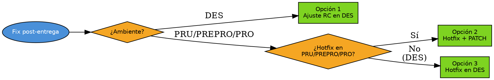

# Fix Release

## Overview

Gestiona fixes y hotfixes sobre releases ya entregados a entornos de destino. Cubre ajustes RC en el entorno de validación y hotfixes en entornos de despliegue con back-merge a develop.

## When to Use

**Usar cuando:** El equipo solicita cambios en el entorno de validación (RC) o reporta bugs en entornos de despliegue (hotfix), incluido hotfix previo a promoción a producción.

**No usar cuando:** Entrega inicial → `entrega-ambiente-banco`. Bug pre-entrega → `fix-develop`.

## Decision Flow

## Implementation

### Datos de entrada

Preguntar: "¿Versión del release?" (ej. v2.2.3). Validar rama/tag. Preguntar: "¿Qué ajuste?"

### Opción 1 — Ajuste RC en DES

El equipo pide cambios. Release branch `release/vX.Y.Z` sigue vivo.

1. Fix sobre rama base. Validar tests (`references/test-commands.md`). Push.
2. Back-merge a develop (via PR si develop está protegida).
3. Crear RC efímera `release/vX.Y.Z-rc.N`. Push.
4. Aprobación final → back-merge final + eliminar release branch.

**Config (obligatorio si aplica):** Si el fix agrega variables, colas, secretos o configuración Vault, ejecutar `pr-config-audit` sobre el diff (rama fix vs `develop`) y generar `CONFIG-ENTORNO-PR` **antes** de la entrega. Adjuntar ese documento al PR.

### Opción 2 — Hotfix en PRU/PREPRO/PRO

Nuevo release con PATCH incrementado.

1. Hotfix branch desde tag del ambiente afectado. Validar tests. Commit.
2. Merge a desarrollo PRIMERO (via PR). Esperar aprobación.
3. Delegar a `entrega-ambiente-banco` o crear release simple: `release/vX.Y.Z+1`.
4. Limpiar hotfix branch.

**Config (obligatorio si aplica):** Si el hotfix agrega variables, colas, secretos o configuración Vault, ejecutar `pr-config-audit` sobre el diff (rama hotfix vs `develop`) y generar `CONFIG-ENTORNO-PR` **antes** de delegar la entrega a `entrega-ambiente-banco`.

### Opción 3 — Hotfix en DES

Igual que Opción 1 (Ajuste RC).

## Quick Reference

| Escenario | Formato | Ejemplo |
|-----------|---------|---------|
| Release normal | `vMAJOR.MINOR.PATCH` | `v2.2.3` |
| RC en DES | `vX.Y.Z-rc.N` | `v2.2.3-rc.1` |
| Hotfix | `vX.Y.Z+1` | `v2.2.4` |
| Promoción | `vX.Y.Z-<ambiente>` | `v2.2.3-pru` |

**Reglas:** RC = rama efímera (eliminar después del merge). Rama base viva durante ciclo RC. Hotfix merge a develop PRIMERO. Hotfix = nuevo release (incrementar PATCH). Flujo completo: develop → entornos de validación → despliegue → producción. No crear tags (los genera el equipo de despliegue). Back-merge siempre. develop protegida → PR.

**Skills:** `entrega-ambiente-banco` · `pr-config-audit` · `ado-pipeline-analyzer`

## Common Mistakes

- **Forzar merge con `--ff-only`:** Si falla, release tiene commits propios (esperado tras fix). No forzar.
- **Hotfix desde develop:** Siempre desde el tag del ambiente afectado. develop puede tener commits que contaminan el fix.
- **Tag RC vs final:** El equipo de despliegue taggea `vX.Y.Z-rc.1` al mergear RC; taggea `vX.Y.Z` (sin RC) como final.
- **Saltar ambientes:** Hotfix pasa por TODOS los ambientes. No promover directamente a PRO.
- **Omitir `pr-config-audit`:** Si el fix toca variables/secretos/Vault y no se genera `CONFIG-ENTORNO-PR`, la config queda sin documentar en ADO Variable Groups / Vault. Ejecutarlo antes de entregar.
