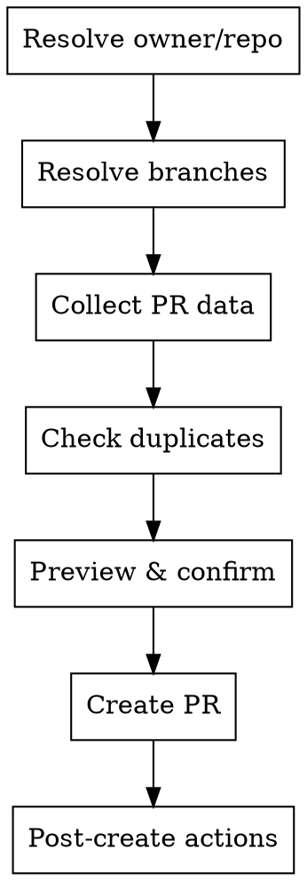

# GitHub PR Creator

Guided creation of Pull Requests on GitHub via REST API (curl + PAT) with duplicate detection, branch validation, and mandatory preview before publishing. Mirrors the flow of `ado-pr-creator` — same shape, different wire.

## When to Use

- User wants to create/open a new PR on a GitHub repo
- User wants to assign reviewers or link issues to a PR
- User pastes a GitHub repo/PR URL asking to create a PR

**When NOT to use:**

- The repo remote is Azure DevOps — use `ado-pr-creator` instead
- Reviewing or approving existing PRs — use `gh-pr-reviewer`
- Merging completed PRs

## Auth

All calls use:
```bash
curl -sS -H "Authorization: Bearer $GITHUB_TOKEN" \
     -H "Accept: application/vnd.github+json" \
     -H "X-GitHub-Api-Version: 2022-11-28" \
     https://api.github.com/...
```
If `$GITHUB_TOKEN` isn't set, ask the user for the PAT or the env var name it's stored under — never hardcode a token in a command.

## Core Flow



### Phase A — Resolve owner/repo

1. From `git remote get-url origin` → parse `owner/repo` (works for both `https://github.com/{owner}/{repo}.git` and `git@github.com:{owner}/{repo}.git`).
2. If no git remote or ambiguous, ask the user for `owner/repo` explicitly.

### Phase B — Resolve branches

1. **Source branch:** `git branch --show-current` → confirm with user or let them override.
2. **Target branch:** ask (common defaults: `develop`, `main`, `staging`). List remote branches (`git branch -r`) if the user is unsure.
3. Validate both exist: `GET /repos/{owner}/{repo}/branches/{branch}`. Reject if `source = target`.

### Phase C — Collect PR data

- **Title:** Conventional Commits `type(scope): summary`. Validate or propose correction.
- **Body:** Draft with Summary, Main Changes, Expected Commits, Validation, Breaking Changes. To link issues, include `Closes #123` / `Fixes #123` in the body — GitHub auto-links and auto-closes on merge (there is no separate "link work item" API call, unlike ADO).
- **Reviewers** and **linked issues**: optional.
- **Firma:** Leer `CONFIG_USER.yaml` (ruta en `archivos.config_user`) y tomar `usuario.nombre`. Si `usuario.incluir_firma_en_documentos` es `true` y `usuario.nombre` no está vacío, agregar al final del body: `> **Generado y revisado por:** {{usuario.nombre}}`. Si está vacío, el archivo no existe, o la opción es `false`, omitir la línea; no inventar un nombre.

### Phase D — Duplicate check & preview

1. `GET /repos/{owner}/{repo}/pulls?head={owner}:{source}&base={target}&state=open` — if a result comes back, show the existing PR instead of creating a new one.
2. Present preview table with repo, branches, title, reviewers, linked issues.
3. Require explicit `[S]` confirmation. Never publish without it.

### Phase E — Create PR & post-actions

1. `POST /repos/{owner}/{repo}/pulls` — body: `{"title": ..., "head": "{source}", "base": "{target}", "body": ...}`.
2. Reviewers (if any): `POST /repos/{owner}/{repo}/pulls/{pull_number}/requested_reviewers` — body: `{"reviewers": [...]}`.
3. Report: PR URL (`html_url` from the create response), number, branch flow, reviewers.
4. Offer: review the new PR (`gh-pr-reviewer`), list open PRs, or done.

## Quick Reference

| Operation | Endpoint | Notes |
|-----------|----------|-------|
| Check existing branch | `GET /repos/{owner}/{repo}/branches/{branch}` | 404 → doesn't exist |
| Duplicate check | `GET /repos/{owner}/{repo}/pulls?head={owner}:{source}&base={target}&state=open` | Empty array → no duplicate |
| Create PR | `POST /repos/{owner}/{repo}/pulls` | `head`/`base` are branch names, not `refs/heads/...` |
| Add reviewers | `POST /repos/{owner}/{repo}/pulls/{pull_number}/requested_reviewers` | `{"reviewers": ["user1"]}` |
| Link issue | none — write `Closes #N` in the PR body | GitHub-native, no API call |

| Error | Response |
|-------|----------|
| No diff between branches | GitHub returns 422 "No commits between X and Y" — inform user, don't retry |
| Source branch missing remotely | "Branch not pushed to GitHub. Push it first." |
| Reviewer resolution fails (422/404) | Continue without them, report which failed |
| 401 | Token invalid/expired — ask user to refresh `$GITHUB_TOKEN`, don't retry automatically |
| 403 (rate limit) | Report remaining quota from `X-RateLimit-Remaining` header, don't auto-retry |

## Common Mistakes

- **Passing `refs/heads/...` to `head`/`base`:** GitHub's PR API wants bare branch names (`develop`, not `refs/heads/develop`) — unlike ADO.
- **Assuming target branch:** Always ask user after showing branch list.
- **Skipping duplicate check:** Always verify no open PR exists for same head→base.
- **Blocking on non-critical failures:** Reviewer-request failures shouldn't cancel PR creation.
- **Trying to "link" an issue via API:** There isn't one — it's just `Closes #N` text in the body.
