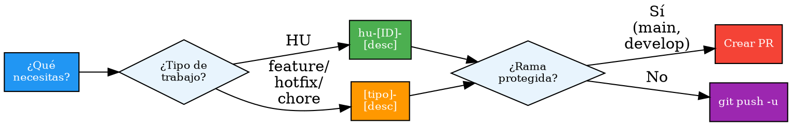

# Git Branch & Commit

## Overview
Crea ramas y gestiona commits con Conventional Commits y preview antes de push.

## When to Use
- Crear rama para HU o feature
- Hacer commit o guardar cambios
- Verificar formato de mensajes de commit

**No usar:**
- Entregas formales a ambiente banco → `entrega-ambiente-banco`
- Fixes post-entrega → `fix-release`
- Commits en `main` o `develop` directamente → siempre crear rama

## Implementation

**Crear rama:**
1. `git fetch origin`; preguntar rama base (main, develop, release/vX.Y.Z); default `develop`
2. Nombre: HU → `hu-[ID]-[desc-kebab]`; otro → `[tipo]-[desc-kebab]` (feature, hotfix, chore, refactor, docs)
3. `git checkout -b [rama] [origen] && git push -u origin [rama]`
4. Commit inicial: `git commit --allow-empty -m "chore: iniciar [descripción]"`

**Hacer commit:**
1. `git status && git diff --staged && git diff`
2. Archivos: [T] todos, [E] específicos, [S] solo staged
3. Tipo: feat / fix / refactor / docs / chore / BREAKING. [auto-gestionar]
4. Scope opcional: `tipo(ámbito): descripción` [auto-gestionar]
5. Mensaje: inglés, imperativo, sin punto, ≤72 chars; BREAKING → `BREAKING CHANGE:` en cuerpo
6. **Mostrar preview del commit al usuario y esperar confirmación**
7. `git commit -m "[mensaje]" && git push origin [rama_actual]`

> **Nota:** `auto-versioning` se auto-activa al detectar push/merge a `main`. No requiere invocación manual.

## Quick Reference

| Tipo | Uso |
|------|-----|
| `feat` | Nueva funcionalidad |
| `fix` | Corrección de errores |
| `refactor` | Optimización sin cambio funcional |
| `docs` | Solo documentación |
| `chore` | Mantenimiento/configuración |
| `BREAKING` | Rompe compatibilidad (cuerpo `BREAKING CHANGE:`) |

Formato rama: HU → `hu-[ID]-[desc]` · General → `[tipo]-[desc]`

## Common Mistakes
- Rama ya existe: preguntar si reusar o crear otra
- `develop` protegida: crear PR en vez de push directo
- Commit vacío rechazado: usar `.gitkeep` temporal
- Sin preview: siempre mostrar diff antes de confirmar
