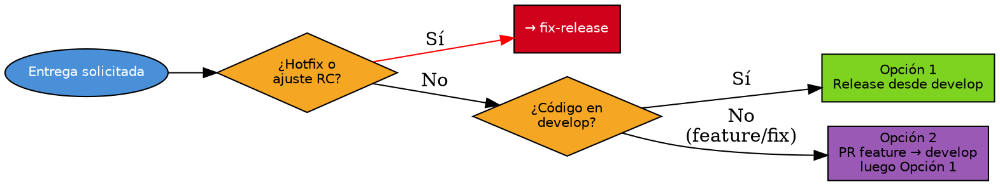

# Handoff Release

## Overview

Orquesta la entrega de releases siguiendo GitFlow: crea ramas release desde develop, genera release notes, valida consistencia y prepara el handoff al equipo deployer.

## When to Use

**Usar cuando:** Feature integrada en develop lista para entregar. Se necesita crear release branch, generar release notes o preparar handoff. Código en feature branch sin merge a develop.

**No usar cuando:** Hotfix o ajuste RC post-entrega → `fix-release`. Entrega formal con artefactos completos → `entrega-ambiente-banco`.

## Decision Flow

## Implementation

> Configuración y convenciones: ver `references/config.md`.

### Opción 1 — Release desde DEVELOP

1. **Verificar develop:** `git fetch origin`. Confirmar pipeline pasó.
2. **Release notes:** `git log <TAG_ANTERIOR>..HEAD --oneline --no-merges > release-notes.md`. Guardar en `entrega_release/{repo}/{version}/`.
3. **Crear release/vX.Y.Z:** Si no existe → `git checkout -b release/vX.Y.Z` desde develop. Si existe → `git merge --ff-only develop` (si falla → detener).
4. **Validar mismo commit:** `git rev-parse develop` vs `git rev-parse release/vX.Y.Z`. Si difieren → detener.
5. **Checklist y resumen:** Guardar en `RESUMEN_ENTREGA_release ({repo}).txt`.

### Opción 2 — Release desde feature/fix

Crear PR `<rama> → develop`. Instruir: una vez mergeado, re-ejecutar con Opción 1.

### Hotfix y ajustes RC

Hotfix post-entrega o ajustes RC → usar `fix-release`.

## Quick Reference

| Concepto | Convención |
|----------|------------|
| Rama release | `release/vX.Y.Z` |
| Tag promoción | `vX.Y.Z-<ambiente>` |
| release-notes | Desde cero en cada release |
| PR a staging | Lo crea el equipo deployer |
| Configuración | `references/config.md` |

**Reglas:** develop y release/vX.Y.Z = mismo commit antes del handoff (usar `--ff-only`). Versionamiento semántico. PR a staging lo crea deployer. No exponer tokens. Si `--ff-only` falla → detener.

**Skills:** `pr-config-audit` (manualmente)

## Common Mistakes

- **develop y release no coinciden:** Verificar con `git rev-parse`. No forzar merge.
- **Release sin verificar pipeline:** Detener si pipeline no pasó.
- **Olvidar back-merge:** Todo fix en release debe propagarse a develop.
- **pr-config-audit:** Esta skill no lo ejecuta. Ejecutar manualmente.
