# Priorizar Backlog

## Overview

Calcula un orden de ejecución sugerido para las HUs del backlog combinando el grafo de dependencias declarado en la tabla `## Dependencias` de cada HU con el campo `Prioridad` (P0–P3). El orden del ID o del título del backlog **nunca** se usa como criterio — no refleja dependencias técnicas reales.

## When to Use

- Hay varias HUs en `[A] Aprobada` o `[P] Planificada` y no está claro cuál planificar/ejecutar primero
- El orden numérico del ID/título no coincide con las dependencias reales (una HU de negocio numerada antes que el cascarón de servicio del que depende)
- Se sospecha una dependencia circular entre HUs o una referencia a una HU que no existe en el backlog

**Cuándo NO usar:**
- Backlog no existe o no tiene `Índice Rápido` (ejecutar `>refinar_hu` primero)
- Solo hay una HU candidata (`[A]`/`[P]`) — no hay nada que ordenar
- El backlog está desincronizado (ejecutar `>sincronizar_backlog` primero; esta skill confía en el `Estado` del Índice Rápido)

## Flowchart

```dot
digraph priorizar_backlog {
  rankdir=LR;
  node [fontname="Helvetica", fontsize=10];
  edge [fontname="Helvetica", fontsize=9];

  start [label="Iniciar", shape=oval, style=filled, fillcolor="#4A90D9", fontcolor=white];
  cargar [label="Cargar backlog\ny candidatas\n[A] / [P]", shape=box, style=filled, fillcolor="#7BC67E"];
  leer_dep [label="Leer tabla\nDependencias\npor HU", shape=box, style=filled, fillcolor="#7BC67E"];
  tipo [label="¿Tipo =\nHU previa?", shape=diamond, style=filled, fillcolor="#F5A623"];
  descartar [label="Advertencia\ninformativa\n(no bloquea)", shape=box, style=filled, fillcolor="#BD10E0", fontcolor=white];
  resuelve [label="¿Referencia\nexiste en backlog?", shape=diamond, style=filled, fillcolor="#F5A623"];
  externa [label="Dependencia externa /\nno verificable\n(advertencia)", shape=box, style=filled, fillcolor="#BD10E0", fontcolor=white];
  completada [label="¿HU referenciada\nen [X] Completada?", shape=diamond, style=filled, fillcolor="#F5A623"];
  resuelta [label="Dependencia resuelta\n(no bloquea)", shape=box, style=filled, fillcolor="#50E3C2"];
  arista [label="Arista de\nbloqueo real", shape=box, style=filled, fillcolor="#D0021B", fontcolor=white];
  grafo [label="Grafo completo", shape=box, style=filled, fillcolor="#7BC67E"];
  ciclo [label="¿Hay ciclo?", shape=diamond, style=filled, fillcolor="#F5A623"];
  manual [label="Excluir HUs\ndel ciclo →\nrevisión manual", shape=box, style=filled, fillcolor="#D0021B", fontcolor=white];
  topo [label="Orden topológico +\ndesempate por Prioridad", shape=box, style=filled, fillcolor="#7ED321"];
  reporte [label="Reporte final", shape=box, style=filled, fillcolor="#4A90D9", fontcolor=white];

  start -> cargar -> leer_dep -> tipo;
  tipo -> descartar [label="No"];
  tipo -> resuelve [label="Sí"];
  resuelve -> externa [label="No"];
  resuelve -> completada [label="Sí"];
  completada -> resuelta [label="Sí"];
  completada -> arista [label="No"];
  descartar -> grafo;
  externa -> grafo;
  resuelta -> grafo;
  arista -> grafo;
  grafo -> ciclo;
  ciclo -> manual [label="Sí"];
  ciclo -> topo [label="No"];
  manual -> topo;
  topo -> reporte;
}
```

## Implementation

1. **Cargar config** → leer `.SAC/config/CONFIG_SYSTEM.yaml` para rutas. Leer también `CONFIG_USER.yaml` (ruta en `archivos.config_user`) y tomar `usuario.nombre` → **`{{usuario.nombre}}`**, necesario para firmar el reporte en el paso 10. Si está vacío, el archivo no existe, o `usuario.incluir_firma_en_documentos` es `false`, omitir la firma; no inventar un nombre.
2. **Cargar backlog** → extraer HUs de la tabla `## 📇 Índice Rápido`; filtrar por `--proyecto` / `--id_hu`
3. **Filtrar candidatas** → Estado ∈ `[A] Aprobada`, `[P] Planificada` (usar `--incluir_refinadas` para sumar `[R] Refinada`)
4. **Leer dependencias** → por cada candidata, leer **solo** `Refinamiento.md`; si el archivo no existe, usar `HU.md` en su lugar (fallback por archivo faltante, no por sección faltante). Extraer la tabla `## Dependencias` / `### Dependencias`. Si el archivo elegido no tiene esa sección, asumir sin dependencias declaradas — no caer al otro archivo, no inventar ninguna. `Plan.md` nunca es fuente de dependencias, ignorarlo en este paso.
5. **Filtrar filas relevantes** → quedarse solo con `Tipo = HU previa`; cualquier otro valor de `Tipo` (`API externa`, `Decisión`, o uno no reconocido) nunca genera arista — se listan aparte como advertencia si su columna `Estado` no es `Disponible`/`Aprobado`
6. **Resolver referencias** → matchear `Referencia` (`HU-XXX`) contra los IDs cargados en el paso 2. La columna `Estado` de la fila de dependencia (p. ej. "Pendiente") es informativa y **no se usa** para decidir el bloqueo — quien decide es el `Estado` real de la HU referenciada en el Índice Rápido:
   - No matchea ningún ID del backlog → dependencia externa/no verificable, se reporta como advertencia, no bloquea el orden
   - Matchea una HU en `[X] Completada` (según el Índice Rápido) → dependencia resuelta, no bloquea
   - Matchea una HU no completada → arista real de bloqueo (bloqueante → bloqueada)
7. **Construir grafo** → dirigido, solo con las aristas reales del paso 6
8. **Detectar ciclos** → si hay ciclo, excluir esas HUs del orden topológico y reportarlas aparte como "Requieren revisión manual (ciclo)"; no se rompe el ciclo adivinando cuál va primero
9. **Ordenar** → topológico sobre el resto: primero las HUs sin bloqueos pendientes; dentro del mismo nivel, desempatar por `Prioridad` (P0 → P3) y, si sigue empatado, por `Fecha Creación` (más antigua primero) leída de la tabla `## Metadatos` de `HU.md`. Si ninguna de las dos HUs empatadas tiene `Fecha Creación`, dejarlas empatadas en el reporte y marcarlas explícitamente como "empate sin desempatar" — nunca usar el orden del ID como desempate silencioso.
10. **Generar reporte** → tabla `Orden | ID | Título | Prioridad | Depende de (pendiente) | Advertencias`. Si `usuario.incluir_firma_en_documentos` es `true`, cerrar el reporte con `> **Generado y revisado por:** {{usuario.nombre}}`; sin `{{usuario.nombre}}` configurado, omitir la línea por completo.

## Quick Reference

### Parámetros

| Parámetro | Tipo | Default | Descripción |
|-----------|------|---------|-------------|
| `proyecto` | string | null | Filtrar HUs de un proyecto |
| `id_hu` | string | null | Limitar el análisis a una HU y sus dependencias directas |
| `--incluir_refinadas` | flag | false | Sumar HUs `[R] Refinada` al orden (aún no aprobadas) |

### Reglas de Arista

| Fila de Dependencias | ¿Genera arista de bloqueo? |
|---|---|
| `Tipo = HU previa`, Referencia en backlog, no `[X]` | Sí |
| `Tipo = HU previa`, Referencia en backlog, en `[X]` Completada | No (resuelta) |
| `Tipo = HU previa`, Referencia NO existe en backlog | No (advertencia: externa/no verificable) |
| `Tipo = API externa` / `Decisión` / cualquier otro valor | Nunca (advertencia informativa si Estado pendiente) |

## Common Mistakes

- Usar el número del ID/título como criterio de orden → es exactamente lo que esta skill reemplaza
- Tratar toda fila de `## Dependencias` como bloqueante → solo `Tipo = HU previa` genera arista
- Ignorar un ciclo y forzar un orden arbitrario → un ciclo se reporta, no se resuelve adivinando
- Asumir que "sin sección Dependencias" significa "backlog corrupto" → simplemente no hay dependencias declaradas
- Confiar en el `Estado` del backlog sin verificar que esté sincronizado → correr `>sincronizar_backlog` antes si hay dudas
- Usar la columna `Estado` de la fila `HU previa` (ej. "Pendiente") para decidir si bloquea → esa columna es informativa; el bloqueo se decide con el `Estado` real de la HU referenciada en el Índice Rápido
- Usar el ID como desempate silencioso cuando falta `Fecha Creación` en un empate de Prioridad → reportar el empate explícitamente, no ordenar por ID
- Leer dependencias de `Plan.md` → nunca es fuente de dependencias

## Después de ejecutar

- `>planificar_hu [ID-HU]` sobre la primera HU del orden sugerido
- `>sincronizar_backlog` si el reporte muestra HUs con estado desactualizado antes de confiar en el orden
