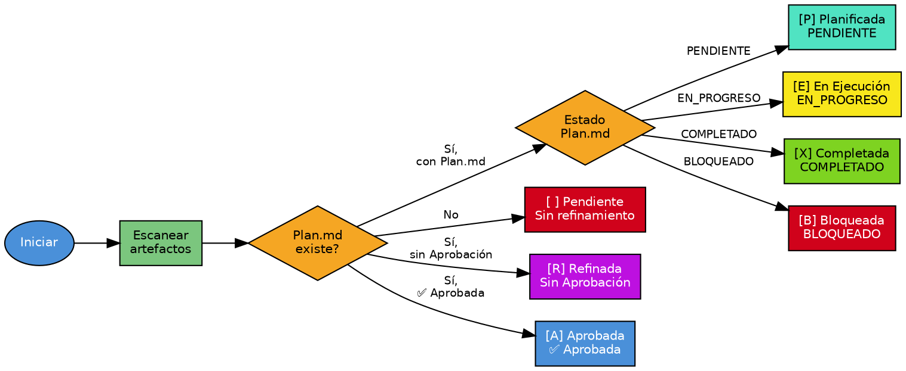

# Sincronizar Backlog

## Overview

Detecta y corrige discrepancias entre el estado del backlog y los artefactos en disco. La fuente de verdad son los artefactos (Refinamiento.md, Plan.md), nunca el backlog.

## When to Use

- El backlog muestra un estado que no coincide con la progresión real
- Se detectaron HUs huérfanas (en backlog sin artefactos)
- Se necesita reporte rápido de estados

**Cuándo NO usar:**
- Backlog no existe (ejecutar >refinar_hu primero)
- Artefactos corruptos o con estructura inválida

## Flowchart

## Implementation

1. **Cargar config** → leer `.SAC/config/CONFIG_SYSTEM.yaml` para rutas
2. **Atajo resumen** → si `--resumen`: extraer Resumen/Índice y mostrar (sin escanear)
3. **Cargar backlog** → extraer HUs (patrón `### [ID-HU]: [Título]`); filtrar por `--id_hu` / `--proyecto`
4. **Escanear artefactos** → por cada HU: Refinamiento.md, Aprobación, Plan.md, carpetas TASK
5. **Deducir estados** → aplicar reglas de deducción
6. **Generar reporte** → clasificar: SINCRONIZADA / DESINCRONIZADA / HUÉRFANA
7. **Si `--dry_run`** → mostrar reporte y terminar
8. **Confirmar** → si discrepancias y `--auto=false`, preguntar al usuario
9. **Aplicar correcciones** → actualizar estados, campos, contadores
10. **Regenerar Índice Rápido** → recorrer todas las HUs y reemplazar tabla

## Quick Reference

### Parámetros

| Parámetro | Tipo | Default | Descripción |
|-----------|------|---------|-------------|
| `id_hu` | string | null | Sincronizar solo una HU específica |
| `--proyecto` | string | null | Filtrar HUs de un proyecto |
| `--auto` | flag | false | Aplicar correcciones sin confirmación |
| `--dry_run` | flag | false | Solo mostrar reporte, no aplicar |
| `--resumen` | flag | false | Mostrar resumen rápido (sin escanear) |

### Reglas de Deducción de Estados

| Estado | Condición |
|--------|-----------|
| `[ ] Pendiente` | No existe refinamiento |
| `[R] Refinada` | Refinamiento SIN sección `## Aprobación` |
| `[A] Aprobada` | Refinamiento CON `## Aprobación` + `**Estado** \| ✅ Aprobada` |
| `[P] Planificada` | Plan.md con Estado = `PENDIENTE` |
| `[E] En Ejecución` | Plan.md con Estado = `EN_PROGRESO` |
| `[X] Completada` | Plan.md con Estado = `COMPLETADO` |
| `[B] Bloqueada` | Plan.md con Estado = `BLOQUEADO` |

**Prioridad:** completada → bloqueada → en_ejecucion → planificada → aprobada → refinada → pendiente

## Common Mistakes

| Error | Causa | Solución |
|-------|-------|----------|
| Backlog no encontrado | No existe | Ejecutar >refinar_hu para crear backlog |
| HU no encontrada | ID incorrecto | Verificar ID con la lista de HUs |
| Artefacto corrupto | Estructura incorrecta | Revisar manualmente el archivo |
| Estado ambiguo | Artefactos no coinciden | Revisar manualmente |

## Después de ejecutar

- `>refinar_hu [ID-HU]` → refinar HUs Pendientes
- `>planificar_hu [ID-HU]` → planificar HUs Aprobadas
