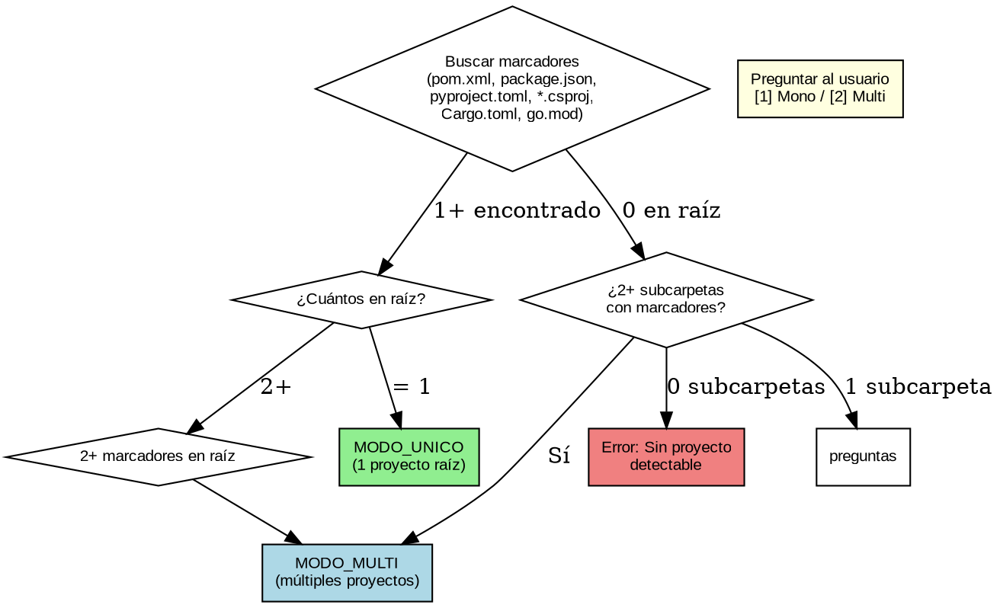

# Tomar Contexto

## Overview
Genera el contexto del proyecto (workspace, scorecard, diagramas y archivos de artifacts) detectando tecnología, arquitectura y DevOps a partir de la configuración del sistema.

## When to Use
- No existe `.SAC/workspace.md` o el contexto tiene más de 7 días.
- El usuario solicita analizar o inicializar un proyecto (mono o multi-proyecto).
- Se requiere contexto previo para refinar HUs, planificar o diagnosticar DevOps.

**Cuándo NO usar:**
- `.SAC/workspace.md` existe Y tiene < 7 días Y usuario no pidió regenerar.
- Usuario solo quiere editar un archivo existente (usar skill específica).
- Ya se ejecutó `tomar_contexto` en esta sesión (evitar duplicar).

## Detección de Workspace

| Caso | Marcadores raíz | Subcarpetas con marcadores | Resultado |
|------|-----------------|---------------------------|-----------|
| Proyecto simple | 1 | 0 | MODO_UNICO |
| Monorepo raíz | 2+ | N/A | MODO_MULTI |
| Monorepo anidado | 0 | 2+ | MODO_MULTI |
| Ambiguo | 0 | 1 | Preguntar |
| Sin proyecto | 0 | 0 | Error |

## Implementation

### Fase A: Cargar y Confirmar
1. Leer `.SAC/config/CONFIG_SYSTEM.yaml` (`artifacts_folder`, `hu_folder`, `contextos_folder`, `adr_folder`) y `CONFIG_USER.yaml` (idioma, overrides). Sin `.SAC/config/` → avisar "No hay instalación SAC".
2. Plantillas propias desde `{file:./assets/}` (backlog, contexto, workspace, lecciones_aprendidas, pendientes).
3. Si existe contexto y no hay `--force` → preguntar [U] usar / [R] regenerar.
4. Mostrar profundidad (`--profundidad_analisis`: basico/completo/exhaustivo) y proyectos detectados; esperar confirmación.

### Fase B: Detectar y Analizar
5. Detectar modo según flowchart de arriba.
6. MODO_MULTI → listar proyectos en tabla `# | Proyecto | Stack | Ruta`; filtrar por `--nombre_proyecto` o `--all`, o preguntar.
7. Analizar: stack (lenguaje/framework/versiones), arquitectura (estilo, carpetas, responsabilidades, dependencias inter-proyecto), DevOps (Docker, CI/CD, IaC, puertos) y Scorecard 1-10 (Arq/Stack/Test/DevOps/Docs).
8. Delegar diagramas a sub-agente `mermaid-diagram` (estructura, clases, secuencia).

### Fase C: Generar y Validar
9. Crear artifacts según `{file:references/artifacts-structure.md}`. Crear carpetas de sistema y archivos de contexto (mono: `contexto_proyecto.md` + `workspace.md`; multi: un contexto por proyecto + `workspace.md` Multi).
10. Validar documentos → preguntar [OK] / [EDITAR] antes de guardar.

## Quick Reference
| Opción | Valores | Descripción |
|--------|---------|-------------|
| `--profundidad_analisis` | basico, completo, exhaustivo | Nivel de análisis (def. exhaustivo) |
| `--nombre_proyecto` | nombre | Proyecto concreto (multi) |
| `--all` | flag | Analizar todos los proyectos |
| `--force` | flag | Regenerar contexto existente |

## Common Mistakes
| Error | Causa | Solución |
|-------|-------|----------|
| Sin archivos detectables | Proyecto vacío/ruta incorrecta | Verificar ruta; generar contexto básico |
| No se detectó proyecto | Sin marcadores | Ejecutar desde la raíz |
| Proyecto no encontrado | Nombre erróneo (multi) | Listar sin `--nombre_proyecto` |
| Ya existe contexto | Sin `--force` | [R] regenerar o [U] usar existente |
| Modo incorrecto | Ambigüedad en detección | Usar `--nombre_proyecto` o preguntar |
