# Validar Criterios de Aceptación

## Overview

Verifica que el código cumple los criterios de aceptación del refinamiento. Fuente de verdad: CAs del refinamiento, nunca del plan.

## When to Use

- Se completó ejecución de tasks de una HU
- Se necesita verificar si un CA está CUMPLIDO, PARCIAL o NO CUMPLIDO

**Cuándo NO usar:**
- HU no refinada o no planificada
- HU en modo Plano con task_id (error: HU plana no tiene tasks)
- Antes de ejecutar el plan (no hay código que validar)

## Flowchart

```dot
digraph validar_ca {
  rankdir=LR;
  node [fontname="Helvetica", fontsize=10];
  edge [fontname="Helvetica", fontsize=9];

  start [label="Iniciar", shape=oval, style=filled, fillcolor="#4A90D9", fontcolor=white];
  load [label="Cargar\nfuentes", shape=box, style=filled, fillcolor="#7BC67E"];
  scope [label="Scope?", shape=diamond, style=filled, fillcolor="#F5A623"];

  granular [label="Validar CA\ngranular task", shape=box, style=filled, fillcolor="#50E3C2"];
  integration [label="Validar CA\nintegración", shape=box, style=filled, fillcolor="#50E3C2"];
  all [label="Validar\ntodos CAs", shape=box, style=filled, fillcolor="#50E3C2"];

  delegate [label="Sub-agente\nvalida CA", shape=box, style=filled, fillcolor="#7BC67E"];
  pass [label="PASS?", shape=diamond, style=filled, fillcolor="#F5A623"];
  stop [label="Detener\nal primer FAIL", shape=box, style=filled, fillcolor="#D0021B", fontcolor=white];

  task_done [label="TASK completa?", shape=diamond, style=filled, fillcolor="#F5A623"];
  ca_candidate [label="CA integración\ncandidato [~]", shape=box, style=filled, fillcolor="#BD10E0", fontcolor=white];
  confirm_scope [label="--scope\nintegracion?", shape=diamond, style=filled, fillcolor="#F5A623"];
  hu_complete [label="HU completada\n[X]", shape=box, style=filled, fillcolor="#7ED321"];

  update_plan [label="Actualizar\nPlan.md", shape=box, style=filled, fillcolor="#7BC67E"];
  update_ref [label="Actualizar\nRefinamiento.md", shape=box, style=filled, fillcolor="#7BC67E"];
  report [label="Emitir\nreporte", shape=box, style=filled, fillcolor="#4A90D9", fontcolor=white];

  start -> load -> scope;
  scope -> granular [label="granulares"];
  scope -> integration [label="integracion"];
  scope -> all [label="todos"];

  granular -> delegate;
  integration -> delegate;
  all -> delegate;

  delegate -> pass;
  pass -> stop [label="FAIL"];
  pass -> update_plan [label="PASS"];

  update_plan -> task_done;
  task_done -> ca_candidate [label="Sí"];
  task_done -> update_ref [label="No"];
  ca_candidate -> confirm_scope;
  confirm_scope -> hu_complete [label="Sí"];
  confirm_scope -> update_ref [label="No"];

  update_ref -> report;
  hu_complete -> report;
}
```

## Implementation

1. **Cargar config** → leer `.SAC/config/CONFIG_SYSTEM.yaml` para rutas
2. **Cargar fuentes** → Refinamiento.md (CAs), Plan.md (estado), HU.md (modo)
3. **Determinar CAs** → Plano: todos; Particionada: granulares/integración/todos
4. **Delegar a sub-agente** → valida cada CA contra código y tests; retorna PASS/FAIL con evidencia
5. **Detener al primer FAIL** → no continuar si algún CA no cumple
6. **Actualizar Plan.md** → marcar checkbox según modo y scope
7. **Actualizar Refinamiento.md** → marcar `[X]` en CAs validados
8. **Emitir reporte** con resultado por CA

**Propagación:** TASK-N completa → CA integración `[~]` candidato → `--scope integracion` confirma `[X]` → HU completada

## Quick Reference

### Parámetros

| Parámetro | Tipo | Default | Descripción |
|-----------|------|---------|-------------|
| `id_hu` | string | — | ID de la HU a validar |
| `--task_id` | string | null | ID de task funcional (requerido para scope=granulares) |
| `--scope` | option | `todos` | `granulares`, `integracion`, `todos` |

### Scopes

| Scope | CAs a validar | Requisito |
|-------|---------------|-----------|
| `granulares` | CAs de una task específica | Requiere `--task_id` |
| `integracion` | CAs de integración (padre) | Todas las tasks en [EJECUTADA] |
| `todos` | Granulares de todas + integración | — |

### Actualización de Plan.md

| Modo | Scope | Acción |
|------|-------|--------|
| Plano | — | `[ ]` → `[X]` en Fase Final |
| Particionada | granulares | `[ ]` → `[X]` en Validar CAs de TASK-N |
| Particionada | integracion | `[~]` → `[X]` en Fase Final: CAs de Integración |

### Veredictos

| Símbolo | Estado | Significado |
|---------|--------|-------------|
| ✅ | CUMPLIDO | PASS |
| ⚠️ | PARCIAL | PASS con observaciones |
| ❌ | NO CUMPLIDO | FAIL (detiene ejecución) |

## Common Mistakes

| Error | Causa | Solución |
|-------|-------|----------|
| Refinamiento no encontrado | HU no refinada | Verificar que la HU fue refinada |
| Plan no encontrado | HU no planificada | Ejecutar >planificar_hu primero |
| No hay código implementado | Tasks no ejecutadas | Ejecutar >ejecutar_plan primero |
| Tasks pendientes para integración | Tasks incompletas | Completar todas las tasks primero |

## Después de ejecutar

- `>ejecutar_plan [ID-HU] --task_id [siguiente]` → continuar con siguiente task
