# Validar Criterios de Aceptación

## Overview

Verifica que el código cumple los criterios de aceptación del refinamiento. Fuente de verdad: CAs del refinamiento, nunca del plan.

## When to Use

- Se completó ejecución de tasks de una HU
- Se necesita verificar si un CA está CUMPLIDO, PARCIAL o NO CUMPLIDO

**Cuándo NO usar:**
- HU no refinada o no planificada
- HU en modo Plano con task_id (error: HU plana no tiene tasks)
- Antes de ejecutar el plan (no hay código que validar)

## Flowchart

```dot
digraph validar_ca {
  rankdir=LR;
  node [fontname="Helvetica", fontsize=10];
  edge [fontname="Helvetica", fontsize=9];

  start [label="Iniciar", shape=oval, style=filled, fillcolor="#4A90D9", fontcolor=white];
  load [label="Cargar\nfuentes", shape=box, style=filled, fillcolor="#7BC67E"];
  scope [label="Scope?", shape=diamond, style=filled, fillcolor="#F5A623"];

  granular [label="CAs granulares\nde la task", shape=box, style=filled, fillcolor="#50E3C2"];
  integration [label="CAs de\nintegración", shape=box, style=filled, fillcolor="#50E3C2"];
  all [label="Todos\nlos CAs", shape=box, style=filled, fillcolor="#50E3C2"];

  evaluate [label="Evaluar CADA CA\ncontra el código\n(sin detenerse)", shape=box, style=filled, fillcolor="#7BC67E"];
  verdict [label="Veredicto\npor CA", shape=diamond, style=filled, fillcolor="#F5A623"];
  ok [label="✅ CUMPLIDO\nmarca [X]", shape=box, style=filled, fillcolor="#7ED321"];
  partial [label="⚠️ PARCIAL\ndeja [ ]", shape=box, style=filled, fillcolor="#F8E71C"];
  fail [label="❌ NO CUMPLIDO\ndeja [ ]", shape=box, style=filled, fillcolor="#D0021B", fontcolor=white];

  update_plan [label="Actualizar\nPlan.md", shape=box, style=filled, fillcolor="#7BC67E"];
  task_done [label="TASK completa?", shape=diamond, style=filled, fillcolor="#F5A623"];
  ca_candidate [label="CA integración\ncandidato [~]", shape=box, style=filled, fillcolor="#BD10E0", fontcolor=white];
  confirm_scope [label="--scope\nintegracion?", shape=diamond, style=filled, fillcolor="#F5A623"];
  hu_complete [label="HU completada\n[X]", shape=box, style=filled, fillcolor="#7ED321"];

  update_ref [label="Actualizar\nRefinamiento.md", shape=box, style=filled, fillcolor="#7BC67E"];
  report [label="Emitir reporte\ncon TODOS los CAs", shape=box, style=filled, fillcolor="#4A90D9", fontcolor=white];

  start -> load -> scope;
  scope -> granular [label="granulares"];
  scope -> integration [label="integracion"];
  scope -> all [label="todos"];

  granular -> evaluate;
  integration -> evaluate;
  all -> evaluate;

  evaluate -> verdict [label="por cada CA"];
  verdict -> ok [label="cumple"];
  verdict -> partial [label="cumple a medias"];
  verdict -> fail [label="no cumple"];

  ok -> update_plan;
  partial -> update_plan;
  fail -> update_plan;

  update_plan -> task_done;
  task_done -> ca_candidate [label="Sí"];
  task_done -> update_ref [label="No"];
  ca_candidate -> confirm_scope;
  confirm_scope -> hu_complete [label="Sí"];
  confirm_scope -> update_ref [label="No"];

  update_ref -> report;
  hu_complete -> report;
}
```



## Implementation

1. **Cargar config** → leer `.SAC/config/CONFIG_SYSTEM.yaml` para rutas
2. **Cargar fuentes** → Refinamiento.md (CAs), Plan.md (estado), HU.md (modo)
3. **Determinar CAs** → Plano: todos; Particionada: granulares/integración/todos
4. **Evaluar cada CA** contra el código, con evidencia ejecutada cuando sea posible
5. **Emitir un veredicto por CA** → `CUMPLIDO` / `PARCIAL` / `NO CUMPLIDO`
6. **Actualizar Plan.md** → marcar checkbox según modo y scope
7. **Actualizar Refinamiento.md** → marcar `[X]` **solo** en los CAs `CUMPLIDO`
8. **Emitir reporte** con el resultado de **todos** los CAs evaluados

### Qué decide el veredicto

**El comportamiento del código, no la cobertura de tests.** Si el código hace lo que el CA
pide, el CA está `CUMPLIDO` aunque ningún test lo cubra. La falta de test se reporta como
**observación**, nunca degrada el veredicto.

| Veredicto | Cuándo |
|-----------|--------|
| `CUMPLIDO` | El código cumple todo lo que el CA pide |
| `PARCIAL` | El código cumple una parte comprobable del CA y deja otra sin cubrir |
| `NO CUMPLIDO` | El código no hace lo que el CA pide |

Verificar ejecutando: correr la suite y, cuando el CA lo permita, invocar el flujo real y
citar la salida obtenida. Leer el código es el último recurso, no el primero.

### Nunca detenerse en el primer fallo

**Evaluar los CAs restantes aunque uno ya haya fallado.** Un CA que falla temprano no dice
nada de los siguientes, y cortar ahí esconde defectos que el usuario necesita ver en la
misma pasada: si CA-03 devuelve el código HTTP equivocado y CA-04 guarda contraseñas en
texto plano, reportar solo el primero convierte un hallazgo de seguridad en una segunda
vuelta.

### Marcado en Refinamiento.md

Solo `CUMPLIDO` marca `[X]`. `PARCIAL` y `NO CUMPLIDO` dejan la casilla en `[ ]` y añaden
la observación al final de la línea:

```
- [X] CA-01: ...
- [ ] CA-02: ... — ⚠️ PARCIAL: valida longitud pero no el dígito exigido
- [ ] CA-03: ... — ❌ NO CUMPLIDO: devuelve 500, se esperaba 409
```

**No usar `[~]` en Refinamiento.md.** Ese marcador existe solo en Plan.md para CAs de
integración candidatos; reutilizarlo aquí hace que el mismo símbolo signifique dos cosas.

**Propagación:** TASK-N completa → CA integración `[~]` candidato en Plan.md → `--scope integracion` confirma `[X]` → HU completada

## Quick Reference

### Parámetros

| Parámetro | Tipo | Default | Descripción |
|-----------|------|---------|-------------|
| `id_hu` | string | — | ID de la HU a validar |
| `--task_id` | string | null | ID de task funcional (requerido para scope=granulares) |
| `--scope` | option | `todos` | `granulares`, `integracion`, `todos` |

### Scopes

| Scope | CAs a validar | Requisito |
|-------|---------------|-----------|
| `granulares` | CAs de una task específica | Requiere `--task_id` |
| `integracion` | CAs de integración (padre) | Todas las tasks en [EJECUTADA] |
| `todos` | Granulares de todas + integración | — |

### Actualización de Plan.md

| Modo | Scope | Acción |
|------|-------|--------|
| Plano | — | `[ ]` → `[X]` en Fase Final |
| Particionada | granulares | `[ ]` → `[X]` en Validar CAs de TASK-N |
| Particionada | integracion | `[~]` → `[X]` en Fase Final: CAs de Integración |

### Veredictos

| Símbolo | Estado | Significado |
|---------|--------|-------------|
| ✅ | CUMPLIDO | El código cumple el CA → marca `[X]` |
| ⚠️ | PARCIAL | Cumple una parte → deja `[ ]` + observación |
| ❌ | NO CUMPLIDO | No cumple → deja `[ ]` + observación |

La validación **nunca se detiene** por un ❌: se evalúan todos los CAs del scope.

## Common Mistakes

| Error | Causa | Solución |
|-------|-------|----------|
| Refinamiento no encontrado | HU no refinada | Verificar que la HU fue refinada |
| Plan no encontrado | HU no planificada | Ejecutar >planificar_hu primero |
| No hay código implementado | Tasks no ejecutadas | Ejecutar >ejecutar_plan primero |
| Tasks pendientes para integración | Tasks incompletas | Completar todas las tasks primero |

## Después de ejecutar

- `>ejecutar_plan [ID-HU] --task_id [siguiente]` → continuar con siguiente task
