# Validar HU

## Overview

Valida una HU refinada contra criterios SMART, arquitectura del proyecto y dependencias, emitiendo veredicto de aprobación.

## When to Use

- HU en estado `[R] Refinada` tras refinamiento
- El usuario solicita validación de una HU refinada

**Cuándo NO usar:** HU en `[A]` → `>planificar_hu`; HU en `[N]` → `>refinar_hu`; HU en `[B]` → resolver dependencia primero.

## Flowchart

```dot
digraph validar_hu {
  rankdir=LR;
  node [fontname="Helvetica", fontsize=10];
  edge [fontname="Helvetica", fontsize=9];

  start [label="Iniciar", shape=oval, style=filled, fillcolor="#4A90D9", fontcolor=white];
  load [label="Cargar config\ny fuentes", shape=box, style=filled, fillcolor="#7BC67E"];
  bug_check [label="Bug\nCrítica?", shape=diamond, style=filled, fillcolor="#F5A623"];
  basic [label="nivel_validacion\n= basico", shape=box, style=filled, fillcolor="#BD10E0", fontcolor=white];

  sub1 [label="Sub-agente 1\nAmbigüedades", shape=box, style=filled, fillcolor="#7BC67E"];
  sub2 [label="Sub-agente 2\nSMART + Cobertura", shape=box, style=filled, fillcolor="#7BC67E"];
  sub3 [label="Sub-agente 3\nTrazabilidad CA", shape=box, style=filled, fillcolor="#7BC67E"];

  consolidate [label="Consolidar\nresultados", shape=box, style=filled, fillcolor="#50E3C2"];
  ambiguity [label="Ambigüedades\ndetectadas?", shape=diamond, style=filled, fillcolor="#F5A623"];
  pause [label="PAUSAR\nesperar respuestas", shape=box, style=filled, fillcolor="#D0021B", fontcolor=white];

  arch [label="Validar\narquitectura + ADR", shape=box, style=filled, fillcolor="#7BC67E"];
  deps [label="Clasificar\ndependencias", shape=box, style=filled, fillcolor="#7BC67E"];
  blocking [label="Dependencia\nbloqueante?", shape=diamond, style=filled, fillcolor="#F5A623"];

  verdict [label="Veredicto", shape=diamond, style=filled, fillcolor="#F5A623"];
  approved [label="APROBADA\n[A]", shape=box, style=filled, fillcolor="#7ED321"];
  adjustments [label="AJUSTES\n[R] + observaciones", shape=box, style=filled, fillcolor="#F8E71C"];
  blocked [label="BLOQUEADA\n[B]", shape=box, style=filled, fillcolor="#D0021B", fontcolor=white];

  start -> load -> bug_check;
  bug_check -> basic [label="Sí"];
  bug_check -> sub1 [label="No"];
  basic -> sub1;

  sub1 -> consolidate;
  sub2 -> consolidate;
  sub3 -> consolidate;

  consolidate -> ambiguity;
  ambiguity -> pause [label="Sí"];
  ambiguity -> arch [label="No"];

  arch -> deps -> blocking;
  blocking -> blocked [label="Sí"];
  blocking -> verdict [label="No"];

  verdict -> approved [label="APROBADA"];
  verdict -> adjustments [label="AJUSTES"];
  verdict -> blocked [label="BLOQUEADA"];
}
```



## Implementation

### 1. Configuración y carga

Leer config, `HU.md`, `Refinamiento.md`, contexto del proyecto, ADR si `ADR_Ref` definido. Bug Crítica → `nivel_validacion='basico'` automático.

### 2. Validación CA (sub-agentes paralelos)

**Sub-agente 1:** Ambigüedades → `SIN_AMBIGÜEDADES` / `CON_AMBIGÜEDADES` + preguntas.
**Sub-agente 2:** SMART + Cobertura (error, validación, performance).
**Sub-agente 3** (Particionada): Trazabilidad CA padre → CA granular Task.

Consolidar → ambigüedades → **PAUSAR** y esperar respuestas.

### 3. Validación arquitectónica y ADR

Delegar a sub-agente: separación de responsabilidades, boundaries, coherencia técnica, ADRs. Detectar contradicciones con ADR referenciado.

### 4. Dependencias y viabilidad

Clasificar: `DEPENDENCIA_HU`, `DEPENDENCIA_EXTERNA`, `DECISION_PENDIENTE`, `RECURSO_NO_DISPONIBLE`. Bloqueante → **BLOQUEADA**.

### 5. Veredicto y persistencia

**APROBADA:** `## Aprobación` en Refinamiento.md → backbone `[R] → [A]`.
**AJUSTES:** `## Feedback de Validación` con observaciones pendientes.
**BLOQUEADA:** `## Bloqueo de Validación` → backbone `[R] → [B]`.

```
✅ HU APROBADA: [ID-HU] → >planificar_hu [ID-HU]
⚠️ HU REQUIERE AJUSTES: [ID-HU] → >refinar_hu [ID-HU]
🚫 HU BLOQUEADA: [ID-HU] → resolver → >validar_hu [ID-HU]
```

## Quick Reference

| Parámetro | Tipo | Default | Descripción |
|-----------|------|---------|-------------|
| `id_hu` | string | — | ID de la HU a validar |
| `--proyecto` | string | null | Proyecto específico (auto-detectado) |
| `--nivel_validacion` | option | `completo` | `basico`, `completo`, `exhaustivo` |

| Veredicto | Estado | Siguiente |
|-----------|--------|-----------|
| APROBADA | `[A] Aprobada` | `>planificar_hu [ID-HU]` |
| AJUSTES | `[R] + observaciones` | `>refinar_hu [ID-HU]` |
| BLOQUEADA | `[B] Bloqueada` | Resolver → revalidar |
| RECHAZADA | `[B] Bloqueada` | Requiere rediseño |

## Common Mistakes

| Error | Causa | Solución |
|-------|-------|----------|
| HU no encontrada | ID incorrecto | Verificar ID |
| HU sin `[R]` | No refinada | Ejecutar `>refinar_hu` primero |
| Sin reglas arquitectónicas | No configuradas | Validar con mejores prácticas generales |
