# Validar HU

## Overview

Valida una HU refinada contra criterios SMART, arquitectura del proyecto y dependencias, emitiendo veredicto de aprobación.

## When to Use

- HU en estado `[R] Refinada` tras refinamiento
- El usuario solicita validación de una HU refinada

**Cuándo NO usar:** HU en `[A]` → `>planificar_hu`; HU en `[N]` → `>refinar_hu`; HU en `[B]` → resolver dependencia primero.

## Flowchart

```dot
digraph validar_hu {
  rankdir=LR;
  node [fontname="Helvetica", fontsize=10];
  edge [fontname="Helvetica", fontsize=9];

  start [label="Iniciar", shape=oval, style=filled, fillcolor="#4A90D9", fontcolor=white];
  load [label="Cargar config\ny fuentes", shape=box, style=filled, fillcolor="#7BC67E"];
  bug_check [label="Bug\nCrítica?", shape=diamond, style=filled, fillcolor="#F5A623"];
  basic [label="nivel_validacion\n= basico", shape=box, style=filled, fillcolor="#BD10E0", fontcolor=white];

  deps [label="Clasificar\ndependencias", shape=box, style=filled, fillcolor="#7BC67E"];
  blocking [label="Dependencia\nbloqueante?", shape=diamond, style=filled, fillcolor="#F5A623"];

  ca [label="Validar CA\nSMART + cobertura\n+ ambigüedades", shape=box, style=filled, fillcolor="#7BC67E"];
  arch [label="Validar\narquitectura + ADR", shape=box, style=filled, fillcolor="#7BC67E"];

  verdict [label="Veredicto", shape=diamond, style=filled, fillcolor="#F5A623"];
  approved [label="APROBADA\n[A]", shape=box, style=filled, fillcolor="#7ED321"];
  adjustments [label="AJUSTES\n[R] + observaciones\n+ preguntas abiertas", shape=box, style=filled, fillcolor="#F8E71C"];
  blocked [label="BLOQUEADA\n[B]", shape=box, style=filled, fillcolor="#D0021B", fontcolor=white];

  persist [label="Persistir\nRefinamiento + backbone", shape=box, style=filled, fillcolor="#50E3C2"];

  start -> load -> bug_check;
  bug_check -> basic [label="Sí"];
  bug_check -> deps [label="No"];
  basic -> deps;

  deps -> blocking;
  blocking -> blocked [label="Sí (corto circuito)"];
  blocking -> ca [label="No"];

  ca -> arch -> verdict;
  verdict -> approved [label="Sin hallazgos"];
  verdict -> adjustments [label="Ambigüedades\no hallazgos"];

  approved -> persist;
  adjustments -> persist;
  blocked -> persist;
}
```



## Implementation

### 1. Configuración y carga

Leer config, `HU.md`, `Refinamiento.md`, contexto del proyecto, ADR si `ADR_Ref` definido. Bug Crítica → `nivel_validacion='basico'` automático.

Leer también `CONFIG_USER.yaml` (ruta en `archivos.config_user`) y tomar `usuario.nombre` → **`{{usuario.nombre}}`**, necesario para firmar el veredicto en el paso 5. Si está vacío o el archivo no existe, omitir el sufijo de la firma; no inventar un nombre.

### 2. Dependencias y viabilidad (corto circuito)

Clasificar cada impedimento declarado en el refinamiento o detectable en el backbone:

| Etiqueta | Qué es |
|----------|--------|
| `DEPENDENCIA_HU` | Otra HU que no está terminada |
| `DEPENDENCIA_EXTERNA` | Sistema o equipo fuera del alcance |
| `DECISION_PENDIENTE` | Definición de negocio sin resolver |
| `RECURSO_NO_DISPONIBLE` | Credencial, ambiente o dato que no existe todavía |

**Si hay al menos una bloqueante → veredicto `BLOQUEADA` directo, saltar a paso 5.** No importa qué tan claros sean los CA: una HU que depende de algo inexistente no se planifica. Usar siempre la etiqueta explícita al reportar.

### 3. Validación de CA

En una sola pasada, sin sub-agentes:

- **SMART:** cada CA específico, medible, alcanzable, relevante y temporal.
- **Cobertura:** casos de error, validación de entrada y performance.
- **Ambigüedades:** términos sin umbral ("rápido", "adecuadamente"). Se registran como **observaciones con preguntas abiertas**, no interrumpen el flujo.
- **Trazabilidad** (solo si Particionada): CA padre → CA granular de cada Task.

**No pausar aquí.** Toda HU real tiene ambigüedades; detenerse en ellas impide emitir veredicto.

### 4. Validación arquitectónica y ADR

Separación de responsabilidades, boundaries, coherencia técnica. Detectar contradicciones con el ADR referenciado en `ADR_Ref`.

### 5. Veredicto y persistencia

Siempre se emite veredicto y siempre se persiste. Un solo veredicto por ejecución:

| Condición | Veredicto |
|-----------|-----------|
| Dependencia bloqueante (paso 2) | `BLOQUEADA` |
| Hallazgos de CA o arquitectura, o ambigüedades abiertas | `AJUSTES` |
| Sin hallazgos | `APROBADA` |

| Veredicto | Sección en Refinamiento.md | Backbone |
|-----------|---------------------------|----------|
| APROBADA | `## Aprobación` | `[R] → [A]` |
| AJUSTES | `## Feedback de Validación` (observaciones + preguntas abiertas) | sigue en `[R]` |
| BLOQUEADA | `## Bloqueo de Validación` (dependencias etiquetadas) | `[R] → [B]` |

**Nunca escribir un rechazo dentro de `## Aprobación`.** Esa sección significa aprobada; un veredicto negativo guardado ahí hace que la HU se lea como aprobada más adelante.

Toda sección lleva el mismo bloque de firma, con el rol del validador y el nombre del usuario:

```
> **Validador:** Arquitecto - {{usuario.nombre}}
> **Fecha:** {{fecha}}
> **Siguiente:** >[skill] [ID-HU]
```

Sin `{{usuario.nombre}}` configurado, la línea queda `> **Validador:** Arquitecto`.

```
✅ HU APROBADA: [ID-HU] → >planificar_hu [ID-HU]
⚠️ HU REQUIERE AJUSTES: [ID-HU] → >refinar_hu [ID-HU]
🚫 HU BLOQUEADA: [ID-HU] → resolver → >validar_hu [ID-HU]
```

## Quick Reference

| Parámetro | Tipo | Default | Descripción |
|-----------|------|---------|-------------|
| `id_hu` | string | — | ID de la HU a validar |
| `--proyecto` | string | null | Proyecto específico (auto-detectado) |
| `--nivel_validacion` | option | `completo` | `basico`, `completo`, `exhaustivo` |

| Veredicto | Estado | Siguiente |
|-----------|--------|-----------|
| APROBADA | `[A] Aprobada` | `>planificar_hu [ID-HU]` |
| AJUSTES | `[R] + observaciones` | `>refinar_hu [ID-HU]` |
| BLOQUEADA | `[B] Bloqueada` | Resolver → revalidar |

## Common Mistakes

| Error | Causa | Solución |
|-------|-------|----------|
| HU no encontrada | ID incorrecto | Verificar ID |
| HU sin `[R]` | No refinada | Ejecutar `>refinar_hu` primero |
| Sin reglas arquitectónicas | No configuradas | Validar con mejores prácticas generales |
